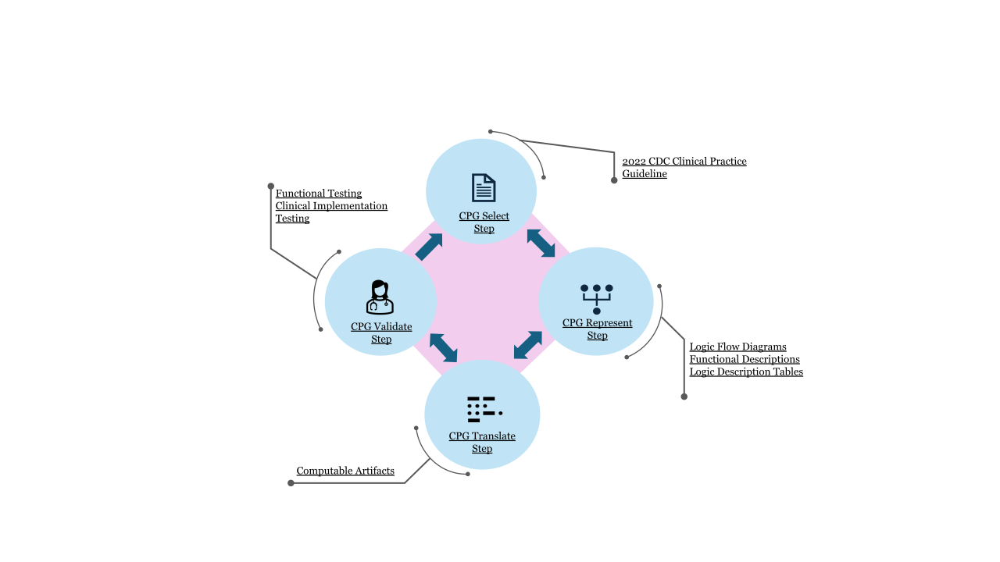

# Home - 2022 CDC Clinical Practice Guideline for Prescribing Opioids Implementation Guide v2022.1.0

* [**Table of Contents**](toc.md)
* **Home**

## Home

| | |
| :--- | :--- |
| *Official URL*:http://fhir.org/guides/cdc/opioid-cds/ImplementationGuide/fhir.cdc.opioid-cds-r4 | *Version*:2022.1.0 |
| Active as of 2026-03-07 | *Computable Name*:Opioid_CDC |
| **Copyright/Legal**: Centers for Disease Control and Prevention (CDC) | |

### Introduction

This implementation guide (IG) provides resources and discussion in support of applying the [Centers for Disease Control and Prevention (CDC) 2022 CDC Clinical Practice Guideline for Prescribing Opioids for Pain](https://www.cdc.gov/mmwr/volumes/71/rr/rr7103a1.htm), including support for the following guideline recommendations:

* [Recommendation #1 - Nonpharmacologic and Nonopioid Pharmacologic Therapy Consideration](recommendation-01.md)
* [Recommendation #2 - Prioritize Nonopioid Pain Therapies](recommendation-02.md)
* [Recommendation #3 - Opioid Immediate Release Form When Starting Opioid Therapy](recommendation-03.md)
* [Recommendations #4 and #5 - Lowest Effective Dose](recommendation-04-05.md)
* [Recommendation #6 - Prescribe Lowest Effective Dose and Duration](recommendation-06.md)
* [Recommendation #7 - Opioid Therapy Risk Assessment](recommendation-07.md)
* [Recommendation #8 - Naloxone Consideration](recommendation-08.md)
* [Recommendation #9 - Consider Patient’s History of Controlled Substance Prescriptions](recommendation-09.md)
* [Recommendation #10 - Urine Drug Testing](recommendation-10.md)
* [Recommendation #11 - Concurrent Use of Opioids and Benzodiazepines](recommendation-11.md)
* [Recommendation #12 - Evidence-based Treatment for Patients with Opioid Use Disorder](recommendation-12.md)

For further details on how the behaviors for the artifacts were determined, refer to the [Process Documentation](process-documentation.md).

### Background

This implementation guide was developed based on work initially done as part of the [Clinical Quality Framework (CQF)](https://confluence.hl7.org/display/CQIWC/Clinical+Quality+Framework) Initiative, a public-private partnership sponsored by the Centers for Medicare & Medicaid Services (CMS) and the U.S. Assistant Secretary for Technology Policy/Office of the National Coordinator for Health Information Technology (ASTP/ONC), to identify, develop, and harmonize standards for clinical decision support and electronic clinical quality measurement, as well as a joint effort by the CDC and ASTP/ONC focused on improving processes for the development of standardized, shareable, computable decision support artifacts using the [2022 CDC Clinical Practice Guideline for Prescribing Opioids for Pain](https://www.cdc.gov/mmwr/volumes/71/rr/rr7103a1.htm) as a model case.

### Feedback and Discussion

Discussions on the use of this IG happen at the [HL7 Clinical Decision Support (CDS) Workgroup](https://confluence.hl7.org/spaces/CDS/pages/40742688/WorkGroup+Home). Feedback and contributions are welcome and can be raised with the CDS Workgroup or submitted directly using the **New Issue** link in the footer of every page.

### Related IGs

#### CPG IG

This implementation guide has followed and applied the [methodology laid out by the HL7 Clinical Practice Guideline (CPG) IG](https://www.hl7.org/fhir/uv/cpg/methodology.html). The CPG IG offers an abstract high-level methodology for translating clinical guidelines into electronic Clinical Decision Support (eCDS) artifacts based on the following steps:

* **Select**: Select content and recommendations for implementation
* **Represent**: Apply selected recommendations to the implementation approach
* **Translate**: Formally express concepts, flow diagrams, and narrative content
* **Validate**: Build and run test cases to verify expected functionality

The following diagram depicts the relationship and (navigable) links between the artifacts in the CPG IG and their respective instantiations in this IG.



#### Data Exchange Profiles IG

The [HL7 Data Exchange Profiles for 2022 CDC Clinical Practice Guideline for Prescribing Opioids](https://build.fhir.org/ig/HL7/cdc-opioid-cpg/) has been developed to define a set of conformance requirements for supporting the data queries used in this implementation guide. By conforming to these profiles (which are derived from US Core) EHRs can ensure they are prepared to support the integration with this IG.

### Trigger Overview

This implementation guide [assumes](process-documentation.md#technical-assumptions) that [CDS Hooks](http://cds-hooks.hl7.org/index.html) serves as the technical framework for EHR integration. The table below outlines the supported triggering events for each guideline recommendation:

| | | | |
| :--- | :--- | :--- | :--- |
| [Recommendation 1](recommendation-01.md) |   |   | ✓ |
| [Recommendation 2](recommendation-02.md) |   |   | ✓ |
| [Recommendation 3](recommendation-03.md) |   |   | ✓ |
| [Recommendation 4](recommendation-04-05.md) |   |   | ✓ |
| [Recommendation 5](recommendation-04-05.md) |   |   | ✓ |
| [Recommendation 6](recommendation-06.md) |   |   | ✓ |
| [Recommendation 7](recommendation-07.md) |   |   | ✓ |
| [Recommendation 8](recommendation-08.md) |   |   | ✓ |
| [Recommendation 9](recommendation-09.md) |   |   | ✓ |
| [Recommendation 10](recommendation-10.md) | ✓* |   | ✓ |
| [Recommendation 11](recommendation-11.md) | ✓* | ✓ |   |
| [Recommendation 12](recommendation-12.md) | ✓ |   |   |

(*) Developed for implementations without capabilities to support the preferred trigger.

### Morphine Milligram Equivalent (MME) Calculation Cautions

1. All doses are in mg/day except for fentanyl, which is mcg/hr.
1. Equianalgesic dose conversions are only estimates and cannot account for individual variability in genetics and pharmacokinetics.
1. Do not use the calculated dose in MMEs to determine the doses to use when converting one opioid to another; when converting opioids, the new opioid is typically dosed at a substantially lower dose than the calculated MME dose to avoid overdose because of incomplete cross-tolerance and individual variability in opioid pharmacokinetics. Consult the FDA approved product labeling for specific guidance on medications.
1. Use particular caution with methadone dose conversions because methadone has a long and variable half-life, and peak respiratory depressant effect occurs later and lasts longer than peak analgesic effect.
1. Use particular caution with transdermal fentanyl because it is dosed in mcg/hr instead of mg/day, and its absorption is affected by heat and other factors.
1. Buprenorphine products approved for the treatment of pain are not included in the table because of their partial µ-receptor agonist activity and resultant ceiling effects compared with full µ-receptor agonists.
1. These conversion factors should not be applied to dosage decisions related to the management of opioid use disorder.

#### Morphine milligram equivalent doses for commonly prescribed opioids for pain management table

| | |
| :--- | :--- |
| Codeine | 0.15 |
| Fentanyl transdermal (in mcg/hr) | 2.4 |
| Hydrocodone | 1.0 |
| Hydromorphone | 5.0 |
| Methadone | 4.7 |
| Morphine | 1.0 |
| Oxycodone | 1.5 |
| Oxymorphone | 3.0 |
| Tapentadol * | 0.4 |
| Tramadol ** | 0.2 |

* Tapentadol is a µ-receptor agonist and norepinephrine reuptake inhibitor. MMEs are based on degree of µ-receptor agonist activity; however, it is unknown whether tapentadol is associated with overdose in the same dose-dependent manner as observed with medications that are solely µ-receptor agonists.

** Tramadol is a µ-receptor agonist and norepinephrine and serotonin reuptake inhibitor. MMEs are based on degree of µ-receptor agonist activity; however, it is unknown whether tramadol is associated with overdose in the same dose-dependent manner as observed with medications that are solely µ-receptor agonists.

### Credits

**Project Team**

* Johnathan Coleman (Security Risk Solutions)
* Mohammad Jafari, PhD (Security Risk Solutions)
* Kensaku Kawamoto, MD, PhD, MHS (Independent)
* Robert McClure, MD (Independent)
* Amber Patel (Security Risk Solutions)
* Bryn Rhodes (Smile CDR)
* Chris Schuler (Smile CDR)
* Greg White (Security Risk Solutions)

**Government Leadership**

* Mera Choi (ASTP)
* Alison Kemp, MPH (ASTP)
* Anastasia Perchem (ASTP)
* Adam Wong, MPP (ASTP)

### Intellectual Property

This publication includes IP covered under the following statements.

* © Copyright 2022 American Medical Association

* [NUCC Provider Taxonomy](http://tx.fhir.org/r4/ValueSet/nucc-provider-taxonomy): [Encounter/oncologist-participant](Encounter-oncologist-participant.md), [ONCOLOGY_SPECIALTY_DESIGNATIONS](ValueSet-oncology-specialty-designations.md) and [PractitionerRole/oncology-specialist](PractitionerRole-oncology-specialist.md)


* Centers for Disease Control and Prevention (CDC)

* [CDC Opioid Override Reasons](CodeSystem-opioidcds-overrideReasons.md): [PlanDefinition_Recommendation_10_Order_Sign](PlanDefinition-opioidcds-10-order-sign.md)


* Copyright 2019+ Centers for Disease Control and Prevention (CDC)

* [CDC MME Usage Context Codes](http://fhir.org/guides/cdc/opioid-mme-r4/3.0.0/CodeSystem-CDCMMEUsageContextCodes.html): [PlanDefinition_Recommendation_04_05_Order_Sign](PlanDefinition-opioidcds-04-05.md)


* This material contains content from [LOINC](http://loinc.org). LOINC is copyright © 1995-2020, Regenstrief Institute, Inc. and the Logical Observation Identifiers Names and Codes (LOINC) Committee and is available at no cost under the [license](http://loinc.org/license). LOINC® is a registered United States trademark of Regenstrief Institute, Inc.

* [LOINC](http://terminology.hl7.org/5.5.0/CodeSystem-v3-loinc.html): [ALL_URINE_DRUG_SCREENING_TESTS](ValueSet-all-urine-drug-screening-tests.md), [AMPHETAMINE_URINE_DRUG_SCREENING_TESTS](ValueSet-amphetamine-urine-drug-screening-tests.md)... Show 18 more, [BARBITURATE_URINE_DRUG_SCREENING_TESTS](ValueSet-barbiturate-urine-drug-screening-tests.md), [BENZODIAZEPINE_URINE_DRUG_SCREENING_TESTS](ValueSet-benzodiazepine-urine-drug-screening-tests.md), [BUPRENORPHINE_URINE_DRUG_SCREENING_TESTS](ValueSet-buprenorphine-urine-drug-screening-tests.md), [CANNABINOID_URINE_DRUG_SCREENING_TESTS](ValueSet-cannabinoid-urine-drug-screening-tests.md), [COCAINE_URINE_DRUG_SCREENING_TESTS](ValueSet-cocaine-urine-drug-screening-tests.md), [FENTANYL_TYPE_URINE_DRUG_SCREENING_TESTS](ValueSet-fentanyl-type-urine-drug-screening-tests.md), [GENERAL_OPIATE_URINE_DRUG_SCREENING_TESTS](ValueSet-general-opiate-urine-drug-screening-tests.md), [HEROIN_URINE_DRUG_SCREENING_TESTS](ValueSet-heroin-urine-drug-screening-tests.md), [METHADONE_URINE_DRUG_SCREENING_TESTS](ValueSet-methadone-urine-drug-screening-tests.md), [NON_OPIOID_URINE_DRUG_SCREENING](ValueSet-non-opioid-urine-drug-screening.md), [OPIATE_SPECIFIC_URINE_DRUG_SCREENING_TESTS](ValueSet-opiate-specific-urine-drug-screening-tests.md), [OPIOID_URINE_DRUG_SCREENING](ValueSet-opioid-urine-drug-screening.md), [OXYCODONE_URINE_DRUG_SCREENING_TESTS](ValueSet-oxycodone-urine-drug-screening-tests.md), [Observation/example-opioidcds](Observation-example-opioidcds.md), [PAIN_TREATMENT_PLAN](ValueSet-pain-treatment-plan.md), [PHENCYCLIDINE_URINE_DRUG_SCREENING_TESTS](ValueSet-phencyclidine-urine-drug-screening-tests.md), [SYNTHETIC_OPIOID_URINE_DRUG_SCREENING_TESTS](ValueSet-synthetic-opioid-urine-drug-screening-tests.md) and [XYLAZINE_URINE_DRUG_SCREENING_TESTS](ValueSet-xylazine-urine-drug-screening-tests.md)


* This material contains content that is copyright of SNOMED International. Implementers of these specifications must have the appropriate SNOMED CT Affiliate license - for more information contact [https://www.snomed.org/get-snomed](https://www.snomed.org/get-snomed) or [info@snomed.org](mailto:info@snomed.org).

* [SNOMED Clinical Terms&reg; (SNOMED CT&reg;)](http://tx.fhir.org/r4/ValueSet/snomedct): [ActivityDefinition_Risk_Assessment_ServiceRequest](ActivityDefinition-opioidcds-risk-assessment-request.md), [ActivityDefinition_Urine_Screening_ServiceRequest](ActivityDefinition-opioidcds-urine-screening-request.md)... Show 39 more, [CONDITIONS_DOCUMENTING_SUBSTANCE_ABUSE](ValueSet-conditions-documenting-substance-misuse.md), [CONDITIONS_LIKELY_TERMINAL_FOR_OPIOID_PRESCRIBING](ValueSet-conditions-likely-terminal-for-opioid-prescribing.md), [Condition/end-of-life](Condition-end-of-life.md), [Condition/terminal](Condition-terminal.md), [ConversionFactors](Library-ConversionFactors.md), [HOSPICE_DISPOSITION](ValueSet-hospice-disposition.md), [HOSPICE_FINDING](ValueSet-hospice-finding.md), [HOSPICE_PROCEDURE](ValueSet-hospice-procedure.md), [LIMITED_LIFE_EXPECTANCY_CONDITIONS](ValueSet-limited-life-expectancy-conditions.md), [MMECalculator](Library-MMECalculator.md), [MedicationRequest/example-opioidcds](MedicationRequest-example-opioidcds.md), [OFFICE_VISIT](ValueSet-office-visit.md), [OMTKData](Library-OMTKData.md), [OMTKLogic](Library-OMTKLogic.md), [OPIOID_COUNSELING_PROCEDURE](ValueSet-opioid-counseling-procedure.md), [OPIOID_MISUSE_ASSESSMENT_PROCEDURE](ValueSet-opioid-misuse-assessment-procedure.md), [OPIOID_MISUSE_DISORDERS](ValueSet-opioid-misuse-disorders.md), [OPIOID_TREATMENT_ASSESSMENT_PROCEDURE](ValueSet-opioid-treatment-assessment-procedure.md), [PAIN_MANAGEMENT_PROCEDURE](ValueSet-pain-management-procedure.md), [PDMP_DATA_REVIEWED_FINDING](ValueSet-pdmp-data-reviewed-finding.md), [PDMP_REVIEW_PROCEDURE](ValueSet-pdmp-review-procedure.md), [PlanDefinition_Recommendation_01_Order_Sign](PlanDefinition-opioidcds-01.md), [PlanDefinition_Recommendation_02_Order_Sign](PlanDefinition-opioidcds-02.md), [PlanDefinition_Recommendation_03_Order_Sign](PlanDefinition-opioidcds-03.md), [PlanDefinition_Recommendation_04_05_Order_Sign](PlanDefinition-opioidcds-04-05.md), [PlanDefinition_Recommendation_06_Order_Sign](PlanDefinition-opioidcds-06.md), [PlanDefinition_Recommendation_07_Order_Sign](PlanDefinition-opioidcds-07.md), [PlanDefinition_Recommendation_08_Order_Sign](PlanDefinition-opioidcds-08.md), [PlanDefinition_Recommendation_09_Order_Sign](PlanDefinition-opioidcds-09.md), [PlanDefinition_Recommendation_10_Order_Sign](PlanDefinition-opioidcds-10-order-sign.md), [PlanDefinition_Recommendation_10_Patient_View](PlanDefinition-opioidcds-10-patient-view.md), [PlanDefinition_Recommendation_11_Order_Select](PlanDefinition-opioidcds-11-order-select.md), [PlanDefinition_Recommendation_11_Patient_View](PlanDefinition-opioidcds-11-patient-view.md), [PlanDefinition_Recommendation_12_Patient_View](PlanDefinition-opioidcds-12-patient-view.md), [SICKLE_CELL_DISEASES](ValueSet-sickle-cell-diseases.md), [SLEEP_DISORDERED_BREATHING](ValueSet-conditions-documenting-sleep-disordered-breathing.md), [SUBSTANCE_MISUSE_BEHAVIORAL_COUNSELING](ValueSet-substance-misuse-behavioral-counseling.md), [ServiceRequest/palliative-care](ServiceRequest-palliative-care.md) and [THERAPIES_INDICATING_END_OF_LIFE_CARE](ValueSet-therapies-indicating-end-of-life-care.md)


* This material derives from the HL7 Terminology (THO). THO is copyright ©1989+ Health Level Seven International and is made available under the CC0 designation. For more licensing information see: [https://terminology.hl7.org/license.html](https://terminology.hl7.org/license.html)

* [ActionType](http://terminology.hl7.org/7.1.0/CodeSystem-action-type.html): [PlanDefinition_Recommendation_07_Order_Sign](PlanDefinition-opioidcds-07.md) and [PlanDefinition_Recommendation_10_Patient_View](PlanDefinition-opioidcds-10-patient-view.md)
* [Condition Category Codes](http://terminology.hl7.org/7.1.0/CodeSystem-condition-category.html): [Condition/cancer-diagnosis](Condition-cancer-diagnosis.md), [Condition/terminal](Condition-terminal.md), [ENCOUNTER_DIAGNOSIS_CONDITION_CATEGORY](ValueSet-condition-encounter-diagnosis-category.md) and [PROBLEM_LIST_CONDITION_CATEGORY](ValueSet-condition-problem-list-category.md)
* [Condition Clinical Status Codes](http://terminology.hl7.org/7.1.0/CodeSystem-condition-clinical.html): [CONDITION_CLINICAL_STATUS_ACTIVE](ValueSet-condition-clinical-status-active.md), [Condition/cancer-diagnosis](Condition-cancer-diagnosis.md), [Condition/end-of-life](Condition-end-of-life.md) and [Condition/terminal](Condition-terminal.md)
* [DefinitionTopic](http://terminology.hl7.org/7.1.0/CodeSystem-definition-topic.html): [ActivityDefinition_Risk_Assessment_ServiceRequest](ActivityDefinition-opioidcds-risk-assessment-request.md) and [ActivityDefinition_Urine_Screening_ServiceRequest](ActivityDefinition-opioidcds-urine-screening-request.md)
* [DoseAndRateType](http://terminology.hl7.org/7.1.0/CodeSystem-dose-rate-type.html): [MedicationRequest/example-opioidcds](MedicationRequest-example-opioidcds.md)
* [QualityOfEvidenceRating](http://terminology.hl7.org/7.1.0/CodeSystem-evidence-quality.html): [PlanDefinition_Recommendation_01_Order_Sign](PlanDefinition-opioidcds-01.md), [PlanDefinition_Recommendation_02_Order_Sign](PlanDefinition-opioidcds-02.md)... Show 11 more, [PlanDefinition_Recommendation_03_Order_Sign](PlanDefinition-opioidcds-03.md), [PlanDefinition_Recommendation_04_05_Order_Sign](PlanDefinition-opioidcds-04-05.md), [PlanDefinition_Recommendation_06_Order_Sign](PlanDefinition-opioidcds-06.md), [PlanDefinition_Recommendation_07_Order_Sign](PlanDefinition-opioidcds-07.md), [PlanDefinition_Recommendation_08_Order_Sign](PlanDefinition-opioidcds-08.md), [PlanDefinition_Recommendation_09_Order_Sign](PlanDefinition-opioidcds-09.md), [PlanDefinition_Recommendation_10_Order_Sign](PlanDefinition-opioidcds-10-order-sign.md), [PlanDefinition_Recommendation_10_Patient_View](PlanDefinition-opioidcds-10-patient-view.md), [PlanDefinition_Recommendation_11_Order_Select](PlanDefinition-opioidcds-11-order-select.md), [PlanDefinition_Recommendation_11_Patient_View](PlanDefinition-opioidcds-11-patient-view.md) and [PlanDefinition_Recommendation_12_Patient_View](PlanDefinition-opioidcds-12-patient-view.md)
* [LibraryType](http://terminology.hl7.org/7.1.0/CodeSystem-library-type.html): [CDCMMEClinicalConversionFactors](Library-CDCMMEClinicalConversionFactors.md), [ConversionFactors](Library-ConversionFactors.md)... Show 39 more, [FHIR](Library-FHIR-ModelInfo.md), [FHIRHelpers](Library-FHIRHelpers.md), [HelloWorld](Library-HelloWorld.md), [HelloWorldPatientView](Library-HelloWorldPatientView.md), [MMECalculator](Library-MMECalculator.md), [OMTKData](Library-OMTKData.md), [OMTKData2020](Library-OMTKData2020.md), [OMTKLogic](Library-OMTKLogic.md), [OMTKLogicMK2020](Library-OMTKLogicMK2020.md), [OpioidCDSCommon](Library-OpioidCDSCommon.md), [OpioidCDSCommonConfig](Library-OpioidCDSCommonConfig.md), [OpioidCDSREC01](Library-OpioidCDSREC01.md), [OpioidCDSREC02](Library-OpioidCDSREC02.md), [OpioidCDSREC03](Library-OpioidCDSREC03.md), [OpioidCDSREC04And05](Library-OpioidCDSREC04And05.md), [OpioidCDSREC06](Library-OpioidCDSREC06.md), [OpioidCDSREC07](Library-OpioidCDSREC07.md), [OpioidCDSREC08](Library-OpioidCDSREC08.md), [OpioidCDSREC09](Library-OpioidCDSREC09.md), [OpioidCDSREC10Common](Library-OpioidCDSREC10Common.md), [OpioidCDSREC10OrderSign](Library-OpioidCDSREC10OrderSign.md), [OpioidCDSREC10PatientView](Library-OpioidCDSREC10PatientView.md), [OpioidCDSREC11OrderSelect](Library-OpioidCDSREC11OrderSelect.md), [OpioidCDSREC11PatientView](Library-OpioidCDSREC11PatientView.md), [OpioidCDSREC12PatientView](Library-OpioidCDSREC12PatientView.md), [OpioidCDSRoutines](Library-OpioidCDSRoutines.md), [PlanDefinition_Recommendation_01_Order_Sign](PlanDefinition-opioidcds-01.md), [PlanDefinition_Recommendation_02_Order_Sign](PlanDefinition-opioidcds-02.md), [PlanDefinition_Recommendation_03_Order_Sign](PlanDefinition-opioidcds-03.md), [PlanDefinition_Recommendation_04_05_Order_Sign](PlanDefinition-opioidcds-04-05.md), [PlanDefinition_Recommendation_06_Order_Sign](PlanDefinition-opioidcds-06.md), [PlanDefinition_Recommendation_07_Order_Sign](PlanDefinition-opioidcds-07.md), [PlanDefinition_Recommendation_08_Order_Sign](PlanDefinition-opioidcds-08.md), [PlanDefinition_Recommendation_09_Order_Sign](PlanDefinition-opioidcds-09.md), [PlanDefinition_Recommendation_10_Order_Sign](PlanDefinition-opioidcds-10-order-sign.md), [PlanDefinition_Recommendation_10_Patient_View](PlanDefinition-opioidcds-10-patient-view.md), [PlanDefinition_Recommendation_11_Order_Select](PlanDefinition-opioidcds-11-order-select.md), [PlanDefinition_Recommendation_11_Patient_View](PlanDefinition-opioidcds-11-patient-view.md) and [PlanDefinition_Recommendation_12_Patient_View](PlanDefinition-opioidcds-12-patient-view.md)
* [MedicationRequest Category Codes](http://terminology.hl7.org/7.1.0/CodeSystem-medicationrequest-category.html): [MedicationRequest/ambulatory-opioid](MedicationRequest-ambulatory-opioid.md) and [Valueset_medicationrequest_category_community](ValueSet-medicationrequest-category-community.md)
* [Observation Category Codes](http://terminology.hl7.org/7.1.0/CodeSystem-observation-category.html): [OBSERVATION_CATEGORY_LABORATORY](ValueSet-observation-category-laboratory.md) and [OBSERVATION_CATEGORY_PROCEDURE](ValueSet-observation-category-procedure.md)
* [PlanDefinitionType](http://terminology.hl7.org/7.1.0/CodeSystem-plan-definition-type.html): [PlanDefinition_Recommendation_01_Order_Sign](PlanDefinition-opioidcds-01.md), [PlanDefinition_Recommendation_02_Order_Sign](PlanDefinition-opioidcds-02.md)... Show 11 more, [PlanDefinition_Recommendation_03_Order_Sign](PlanDefinition-opioidcds-03.md), [PlanDefinition_Recommendation_04_05_Order_Sign](PlanDefinition-opioidcds-04-05.md), [PlanDefinition_Recommendation_06_Order_Sign](PlanDefinition-opioidcds-06.md), [PlanDefinition_Recommendation_07_Order_Sign](PlanDefinition-opioidcds-07.md), [PlanDefinition_Recommendation_08_Order_Sign](PlanDefinition-opioidcds-08.md), [PlanDefinition_Recommendation_09_Order_Sign](PlanDefinition-opioidcds-09.md), [PlanDefinition_Recommendation_10_Order_Sign](PlanDefinition-opioidcds-10-order-sign.md), [PlanDefinition_Recommendation_10_Patient_View](PlanDefinition-opioidcds-10-patient-view.md), [PlanDefinition_Recommendation_11_Order_Select](PlanDefinition-opioidcds-11-order-select.md), [PlanDefinition_Recommendation_11_Patient_View](PlanDefinition-opioidcds-11-patient-view.md) and [PlanDefinition_Recommendation_12_Patient_View](PlanDefinition-opioidcds-12-patient-view.md)
* [StrengthOfRecommendationRating](http://terminology.hl7.org/7.1.0/CodeSystem-recommendation-strength.html): [PlanDefinition_Recommendation_01_Order_Sign](PlanDefinition-opioidcds-01.md), [PlanDefinition_Recommendation_02_Order_Sign](PlanDefinition-opioidcds-02.md)... Show 11 more, [PlanDefinition_Recommendation_03_Order_Sign](PlanDefinition-opioidcds-03.md), [PlanDefinition_Recommendation_04_05_Order_Sign](PlanDefinition-opioidcds-04-05.md), [PlanDefinition_Recommendation_06_Order_Sign](PlanDefinition-opioidcds-06.md), [PlanDefinition_Recommendation_07_Order_Sign](PlanDefinition-opioidcds-07.md), [PlanDefinition_Recommendation_08_Order_Sign](PlanDefinition-opioidcds-08.md), [PlanDefinition_Recommendation_09_Order_Sign](PlanDefinition-opioidcds-09.md), [PlanDefinition_Recommendation_10_Order_Sign](PlanDefinition-opioidcds-10-order-sign.md), [PlanDefinition_Recommendation_10_Patient_View](PlanDefinition-opioidcds-10-patient-view.md), [PlanDefinition_Recommendation_11_Order_Select](PlanDefinition-opioidcds-11-order-select.md), [PlanDefinition_Recommendation_11_Patient_View](PlanDefinition-opioidcds-11-patient-view.md) and [PlanDefinition_Recommendation_12_Patient_View](PlanDefinition-opioidcds-12-patient-view.md)
* [Software System Type Codes](http://terminology.hl7.org/7.1.0/CodeSystem-software-system-type-codes.html): [Device/cqf-tooling](Device-cqf-tooling.md)
* [UsageContextType](http://terminology.hl7.org/7.1.0/CodeSystem-usage-context-type.html): [ActivityDefinition_Risk_Assessment_ServiceRequest](ActivityDefinition-opioidcds-risk-assessment-request.md), [ActivityDefinition_Urine_Screening_ServiceRequest](ActivityDefinition-opioidcds-urine-screening-request.md)... Show 17 more, [ConversionFactors](Library-ConversionFactors.md), [MMECalculator](Library-MMECalculator.md), [OMTKData](Library-OMTKData.md), [OMTKLogic](Library-OMTKLogic.md), [PlanDefinition_Recommendation_01_Order_Sign](PlanDefinition-opioidcds-01.md), [PlanDefinition_Recommendation_02_Order_Sign](PlanDefinition-opioidcds-02.md), [PlanDefinition_Recommendation_03_Order_Sign](PlanDefinition-opioidcds-03.md), [PlanDefinition_Recommendation_04_05_Order_Sign](PlanDefinition-opioidcds-04-05.md), [PlanDefinition_Recommendation_06_Order_Sign](PlanDefinition-opioidcds-06.md), [PlanDefinition_Recommendation_07_Order_Sign](PlanDefinition-opioidcds-07.md), [PlanDefinition_Recommendation_08_Order_Sign](PlanDefinition-opioidcds-08.md), [PlanDefinition_Recommendation_09_Order_Sign](PlanDefinition-opioidcds-09.md), [PlanDefinition_Recommendation_10_Order_Sign](PlanDefinition-opioidcds-10-order-sign.md), [PlanDefinition_Recommendation_10_Patient_View](PlanDefinition-opioidcds-10-patient-view.md), [PlanDefinition_Recommendation_11_Order_Select](PlanDefinition-opioidcds-11-order-select.md), [PlanDefinition_Recommendation_11_Patient_View](PlanDefinition-opioidcds-11-patient-view.md) and [PlanDefinition_Recommendation_12_Patient_View](PlanDefinition-opioidcds-12-patient-view.md)
* [ActCode](http://terminology.hl7.org/7.1.0/CodeSystem-v3-ActCode.html): [Encounter/cancer-diagnosis](Encounter-cancer-diagnosis.md) and [Encounter/oncologist-participant](Encounter-oncologist-participant.md)
* [ObservationInterpretation](http://terminology.hl7.org/7.1.0/CodeSystem-v3-ObservationInterpretation.html): [Observation/example-opioidcds](Observation-example-opioidcds.md)


* Used by permission of HL7 International, all rights reserved Creative Commons License

* [US Core Condition Category Extension Codes](http://tx.fhir.org/r4/ValueSet/934): [Condition/end-of-life](Condition-end-of-life.md) and [US_CORE_HEALTH_CONCERN_CONDITION_CATEGORY](ValueSet-condition-us-core-health-concern-category.md)


* Using RxNorm codes of type SAB=RXNORM as this specification describes does not require a UMLS license. Access to the full set of RxNorm definitions, and/or additional use of other RxNorm structures and information requires a UMLS license. The use of RxNorm in this specification is pursuant to HL7's status as a licensee of the NLM UMLS. HL7's license does not convey the right to use RxNorm to any users of this specification; implementers must acquire a license to use RxNorm in their own right.

* [RxNorm](http://terminology.hl7.org/5.5.0/CodeSystem-v3-rxNorm.html): [AMPHETAMINES_CLASS_MEDICATIONS](ValueSet-amphetamines-class-medications.md), [BARBITURATE_MEDICATIONS](ValueSet-barbiturate-medications.md)... Show 15 more, [BENZODIAZEPINE_MEDICATIONS](ValueSet-benzodiazepine-medications.md), [BUPRENORPHINE_AND_METHADONE_MEDICATIONS](ValueSet-buprenorphine-and-methadone-medications.md), [BUPRENORPHINE_MEDICATIONS](ValueSet-buprenorphine-medications.md), [CNS_DEPRESSANT_MEDICATIONS](ValueSet-cns-depressant-medications.md), [EXTENDED_RELEASE_OPIOID_WITH_AMBULATORY_MISUSE_POTENTIAL](ValueSet-extended-release-opioid-with-ambulatory-misuse-potential.md), [FENTANYL_TYPE_MEDICATIONS](ValueSet-fentanyl-type-medications.md), [METHADONE_MEDICATIONS](ValueSet-methadone-medications.md), [MedicationDispense/ambulatory-opioid](MedicationDispense-ambulatory-opioid.md), [MedicationRequest/ambulatory-opioid](MedicationRequest-ambulatory-opioid.md), [MedicationRequest/example-opioidcds](MedicationRequest-example-opioidcds.md), [NALOXONE_MEDICATIONS](ValueSet-naloxone-medications.md), [NON_SYNTHETIC_OPIOID_MEDICATIONS](ValueSet-non-synthetic-opioid-medications.md), [OPIOID_ANALGESICS_WITH_AMBULATORY_MISUSE_POTENTIAL](ValueSet-opioid-analgesics-with-ambulatory-misuse-potential.md), [OXYCODONE_MEDICATIONS](ValueSet-oxycodone-medications.md) and [SYNTHETIC_OPIOID_MEDICATIONS](ValueSet-synthetic-opioid-medications.md)


### Cross Version Analysis

This is an R4 IG. None of the features it uses are changed in R4B, so it can be used as is with R4B systems. Packages for both [R4 (fhir.cdc.opioid-cds-r4.r4)](package.r4.tgz) and [R4B (fhir.cdc.opioid-cds-r4.r4b)](package.r4b.tgz) are available.

### Dependencies


### Globals

*There are no Global profiles defined*

### Expansion Parameters

* Parameter: system-version
  * Value: SNOMED CT[US rel. Oct 0012]
* Parameter: default-canonical-version
  * Value: http://hl7.org/fhir/uv/cpg/StructureDefinition/cpg-computablevalueset|1.0.0
* Parameter: default-canonical-version
  * Value: http://hl7.org/fhir/uv/cpg/StructureDefinition/cpg-executablevalueset|1.0.0
* Parameter: system-version
  * Value: International Classification of Diseases, 10th Revision, Clinical Modification (ICD-10-CM)[2.0.1]
* Parameter: system-version
  * Value: NUCC Provider Taxonomy[4.0.0]
* Parameter: default-canonical-version
  * Value: http://hl7.org/fhir/uv/cpg/StructureDefinition/cpg-shareablelibrary|1.0.0
* Parameter: default-canonical-version
  * Value: http://hl7.org/fhir/uv/cpg/StructureDefinition/cpg-computablelibrary|1.0.0
* Parameter: default-canonical-version
  * Value: http://hl7.org/fhir/uv/cpg/StructureDefinition/cpg-publishablelibrary|1.0.0
* Parameter: default-canonical-version
  * Value: http://hl7.org/fhir/uv/cpg/StructureDefinition/cpg-executablelibrary|1.0.0
* Parameter: system-version
  * Value: UsageContextType[2.0.1]
* Parameter: system-version
  * Value: CDC MME Usage Context Codes[3.0.0]
* Parameter: default-canonical-version
  * Value: http://hl7.org/fhir/StructureDefinition/Patient|4.0.1
* Parameter: system-version
  * Value: RxNorm[3.0.1]
* Parameter: system-version
  * Value: LOINC[3.1.0]
* Parameter: default-valueset-version
  * Value: limited-life-expectancy-conditions[2022.1.0]
* Parameter: default-valueset-version
  * Value: therapies-indicating-end-of-life-care[2022.1.0]
* Parameter: default-valueset-version
  * Value: conditions-likely-terminal-for-opioid-prescribing[2022.1.0]
* Parameter: default-valueset-version
  * Value: cdc-malignant-cancer-conditions[2022.1.0]
* Parameter: default-valueset-version
  * Value: oncology-specialty-designations[2022.1.0]
* Parameter: default-valueset-version
  * Value: opioid-misuse-disorders[2022.1.0]
* Parameter: default-valueset-version
  * Value: substance-misuse-behavioral-counseling[2022.1.0]
* Parameter: default-valueset-version
  * Value: conditions-documenting-substance-misuse[2022.1.0]
* Parameter: default-valueset-version
  * Value: office-visit[0.2.0]
* Parameter: default-valueset-version
  * Value: opioid-counseling-procedure[2022.1.0]
* Parameter: default-valueset-version
  * Value: opioid-misuse-assessment-procedure[2022.1.0]
* Parameter: default-valueset-version
  * Value: hospice-disposition[2022.1.0]
* Parameter: default-valueset-version
  * Value: hospice-finding[2022.1.0]
* Parameter: default-valueset-version
  * Value: observation-category-laboratory[2022.1.0]
* Parameter: default-valueset-version
  * Value: observation-category-procedure[2022.1.0]
* Parameter: default-valueset-version
  * Value: pain-treatment-plan[2022.1.0]
* Parameter: default-valueset-version
  * Value: pain-management-procedure[2022.1.0]
* Parameter: default-valueset-version
  * Value: pdmp-review-procedure[2022.1.0]
* Parameter: default-valueset-version
  * Value: pdmp-data-reviewed-finding[2022.1.0]
* Parameter: default-valueset-version
  * Value: conditions-documenting-sleep-disordered-breathing[2022.1.0]
* Parameter: default-valueset-version
  * Value: opioid-analgesics-with-ambulatory-misuse-potential[2022.1.0]
* Parameter: default-valueset-version
  * Value: extended-release-opioid-with-ambulatory-misuse-potential[2022.1.0]
* Parameter: default-valueset-version
  * Value: buprenorphine-medications[2022.1.0]
* Parameter: default-valueset-version
  * Value: buprenorphine-and-methadone-medications[2022.1.0]
* Parameter: default-valueset-version
  * Value: non-synthetic-opioid-medications[2022.1.0]
* Parameter: default-valueset-version
  * Value: barbiturate-medications[2022.1.0]
* Parameter: default-valueset-version
  * Value: benzodiazepine-medications[2022.1.0]
* Parameter: default-valueset-version
  * Value: naloxone-medications[2022.1.0]
* Parameter: default-valueset-version
  * Value: fentanyl-type-medications[2022.1.0]
* Parameter: default-valueset-version
  * Value: amphetamines-class-medications[2022.1.0]
* Parameter: default-valueset-version
  * Value: methadone-medications[2022.1.0]
* Parameter: default-valueset-version
  * Value: oxycodone-medications[2022.1.0]
* Parameter: default-valueset-version
  * Value: synthetic-opioid-medications[2022.1.0]
* Parameter: default-valueset-version
  * Value: cns-depressant-medications[2022.1.0]
* Parameter: default-valueset-version
  * Value: all-urine-drug-screening-tests[2022.1.0]
* Parameter: default-valueset-version
  * Value: non-opioid-urine-drug-screening[2022.1.0]
* Parameter: default-valueset-version
  * Value: opiate-specific-urine-drug-screening-tests[2022.1.0]
* Parameter: default-valueset-version
  * Value: general-opiate-urine-drug-screening-tests[2022.1.0]
* Parameter: default-valueset-version
  * Value: opioid-urine-drug-screening[2022.1.0]
* Parameter: default-valueset-version
  * Value: cocaine-urine-drug-screening-tests[2022.1.0]
* Parameter: default-valueset-version
  * Value: phencyclidine-urine-drug-screening-tests[2022.1.0]
* Parameter: default-valueset-version
  * Value: fentanyl-type-urine-drug-screening-tests[2022.1.0]
* Parameter: default-valueset-version
  * Value: amphetamine-urine-drug-screening-tests[2022.1.0]
* Parameter: default-valueset-version
  * Value: cannabinoid-urine-drug-screening-tests[2022.1.0]
* Parameter: default-valueset-version
  * Value: methadone-urine-drug-screening-tests[2022.1.0]
* Parameter: default-valueset-version
  * Value: synthetic-opioid-urine-drug-screening-tests[2022.1.0]
* Parameter: default-valueset-version
  * Value: barbiturate-urine-drug-screening-tests[2022.1.0]
* Parameter: default-valueset-version
  * Value: benzodiazepine-urine-drug-screening-tests[2022.1.0]
* Parameter: default-valueset-version
  * Value: buprenorphine-urine-drug-screening-tests[2022.1.0]
* Parameter: default-valueset-version
  * Value: heroin-urine-drug-screening-tests[2022.1.0]
* Parameter: default-valueset-version
  * Value: oxycodone-urine-drug-screening-tests[2022.1.0]
* Parameter: default-valueset-version
  * Value: medicationrequest-category-community[0.0.1]
* Parameter: default-valueset-version
  * Value: condition-clinical-status-active[2022.1.0]
* Parameter: default-valueset-version
  * Value: medicationrequest-status-active[0.0.1]
* Parameter: default-valueset-version
  * Value: condition-encounter-diagnosis-category[2022.1.0]
* Parameter: default-valueset-version
  * Value: condition-problem-list-category[2022.1.0]
* Parameter: default-valueset-version
  * Value: condition-us-core-health-concern-category[2022.1.0]
* Parameter: default-valueset-version
  * Value: sickle-cell-diseases[2022.1.0]
* Parameter: default-canonical-version
  * Value: http://hl7.org/fhir/StructureDefinition/MedicationRequest|4.0.1
* Parameter: default-canonical-version
  * Value: http://hl7.org/fhir/StructureDefinition/Medication|4.0.1
* Parameter: default-canonical-version
  * Value: http://hl7.org/fhir/StructureDefinition/Condition|4.0.1
* Parameter: default-canonical-version
  * Value: http://hl7.org/fhir/StructureDefinition/Observation|4.0.1
* Parameter: default-canonical-version
  * Value: http://hl7.org/fhir/StructureDefinition/Encounter|4.0.1
* Parameter: default-canonical-version
  * Value: http://hl7.org/fhir/StructureDefinition/CarePlan|4.0.1
* Parameter: default-canonical-version
  * Value: http://hl7.org/fhir/StructureDefinition/Procedure|4.0.1
* Parameter: default-canonical-version
  * Value: http://hl7.org/fhir/StructureDefinition/MedicationDispense|4.0.1
* Parameter: default-canonical-version
  * Value: http://hl7.org/fhir/uv/cpg/StructureDefinition/cpg-recommendationdefinition|1.0.0
* Parameter: default-canonical-version
  * Value: http://hl7.org/fhir/uv/cpg/StructureDefinition/cpg-publishableplandefinition|1.0.0
* Parameter: default-canonical-version
  * Value: http://fhir.org/guides/cdc/opioid-cds/Library/OpioidCDSREC01|2022.1.0
* Parameter: default-canonical-version
  * Value: http://fhir.org/guides/cdc/opioid-cds/Library/OpioidCDSREC02|2022.1.0
* Parameter: default-canonical-version
  * Value: http://fhir.org/guides/cdc/opioid-cds/Library/OpioidCDSREC03|2022.1.0
* Parameter: default-canonical-version
  * Value: http://fhir.org/guides/cdc/opioid-cds/Library/OpioidCDSREC04And05|2022.1.0
* Parameter: default-canonical-version
  * Value: http://fhir.org/guides/cdc/opioid-cds/Library/OpioidCDSREC06|2022.1.0
* Parameter: default-canonical-version
  * Value: http://fhir.org/guides/cdc/opioid-cds/Library/OpioidCDSREC07|2022.1.0
* Parameter: default-canonical-version
  * Value: http://fhir.org/guides/cdc/opioid-cds/ActivityDefinition/opioidcds-risk-assessment-request|2022.1.0
* Parameter: default-canonical-version
  * Value: http://fhir.org/guides/cdc/opioid-cds/Library/OpioidCDSREC08|2022.1.0
* Parameter: default-canonical-version
  * Value: http://fhir.org/guides/cdc/opioid-cds/Library/OpioidCDSREC09|2022.1.0
* Parameter: default-canonical-version
  * Value: http://fhir.org/guides/cdc/opioid-cds/Library/OpioidCDSREC10OrderSign|2022.1.0
* Parameter: default-canonical-version
  * Value: http://fhir.org/guides/cdc/opioid-cds/Library/OpioidCDSREC10PatientView|2022.1.0
* Parameter: default-canonical-version
  * Value: http://fhir.org/guides/cdc/opioid-cds/ActivityDefinition/opioidcds-urine-screening-request|2022.1.0
* Parameter: default-canonical-version
  * Value: http://fhir.org/guides/cdc/opioid-cds/Library/OpioidCDSREC11OrderSelect|2022.1.0
* Parameter: default-canonical-version
  * Value: http://fhir.org/guides/cdc/opioid-cds/Library/OpioidCDSREC11PatientView|2022.1.0
* Parameter: default-canonical-version
  * Value: http://fhir.org/guides/cdc/opioid-cds/Library/OpioidCDSREC12PatientView|2022.1.0


## Resource Content

```json
{
  "resourceType" : "ImplementationGuide",
  "id" : "fhir.cdc.opioid-cds-r4",
  "url" : "http://fhir.org/guides/cdc/opioid-cds/ImplementationGuide/fhir.cdc.opioid-cds-r4",
  "version" : "2022.1.0",
  "name" : "Opioid_CDC",
  "title" : "2022 CDC Clinical Practice Guideline for Prescribing Opioids Implementation Guide",
  "status" : "active",
  "experimental" : false,
  "date" : "2026-03-07",
  "publisher" : "CDC / Security Risk Solutions, Inc. (SRS)",
  "contact" : [{
    "telecom" : [{
      "system" : "url",
      "value" : "https://www.securityrisksolutions.com"
    }]
  }],
  "description" : "2022 CDC Clinical Practice Guideline for Prescribing Opioids Implementation Guide",
  "copyright" : "Centers for Disease Control and Prevention (CDC)",
  "packageId" : "fhir.cdc.opioid-cds-r4",
  "license" : "CC0-1.0",
  "fhirVersion" : ["4.0.1"],
  "dependsOn" : [{
    "id" : "hl7tx",
    "extension" : [{
      "url" : "http://hl7.org/fhir/tools/StructureDefinition/implementationguide-dependency-comment",
      "valueMarkdown" : "Automatically added as a dependency - all IGs depend on HL7 Terminology"
    }],
    "uri" : "http://terminology.hl7.org/ImplementationGuide/hl7.terminology",
    "packageId" : "hl7.terminology.r4",
    "version" : "7.1.0"
  },
  {
    "id" : "hl7ext",
    "extension" : [{
      "url" : "http://hl7.org/fhir/tools/StructureDefinition/implementationguide-dependency-comment",
      "valueMarkdown" : "Automatically added as a dependency - all IGs depend on the HL7 Extension Pack"
    }],
    "uri" : "http://hl7.org/fhir/extensions/ImplementationGuide/hl7.fhir.uv.extensions",
    "packageId" : "hl7.fhir.uv.extensions.r4",
    "version" : "5.2.0"
  },
  {
    "uri" : "http://hl7.org/fhir/uv/cpg/ImplementationGuide/hl7.fhir.uv.cpg",
    "packageId" : "hl7.fhir.uv.cpg",
    "version" : "1.0.0"
  },
  {
    "uri" : "http://fhir.org/guides/cdc/opioid-mme-r4/ImplementationGuide/fhir.cdc.opioid-mme-r4",
    "packageId" : "fhir.cdc.opioid-mme-r4",
    "version" : "3.0.0"
  },
  {
    "uri" : "http://hl7.org/fhir/uv/crmi/ImplementationGuide/hl7.fhir.uv.crmi",
    "packageId" : "hl7.fhir.uv.crmi",
    "version" : "1.0.0"
  }],
  "definition" : {
    "extension" : [{
      "extension" : [{
        "url" : "code",
        "valueString" : "copyrightyear"
      },
      {
        "url" : "value",
        "valueString" : "2019+"
      }],
      "url" : "http://hl7.org/fhir/tools/StructureDefinition/ig-parameter"
    },
    {
      "extension" : [{
        "url" : "code",
        "valueString" : "releaselabel"
      },
      {
        "url" : "value",
        "valueString" : "Release 2022.1"
      }],
      "url" : "http://hl7.org/fhir/tools/StructureDefinition/ig-parameter"
    },
    {
      "extension" : [{
        "url" : "code",
        "valueString" : "apply-version"
      },
      {
        "url" : "value",
        "valueString" : "false"
      }],
      "url" : "http://hl7.org/fhir/tools/StructureDefinition/ig-parameter"
    },
    {
      "extension" : [{
        "url" : "code",
        "valueString" : "default-version"
      },
      {
        "url" : "value",
        "valueString" : "true"
      }],
      "url" : "http://hl7.org/fhir/tools/StructureDefinition/ig-parameter"
    },
    {
      "extension" : [{
        "url" : "code",
        "valueString" : "shownav"
      },
      {
        "url" : "value",
        "valueString" : "true"
      }],
      "url" : "http://hl7.org/fhir/tools/StructureDefinition/ig-parameter"
    },
    {
      "extension" : [{
        "url" : "code",
        "valueString" : "path-liquid"
      },
      {
        "url" : "value",
        "valueString" : "templates/liquid"
      }],
      "url" : "http://hl7.org/fhir/tools/StructureDefinition/ig-parameter"
    },
    {
      "extension" : [{
        "url" : "code",
        "valueString" : "path-expansion-params"
      },
      {
        "url" : "value",
        "valueString" : "resources/parameters/Parameters-manifest.json"
      }],
      "url" : "http://hl7.org/fhir/tools/StructureDefinition/ig-parameter"
    },
    {
      "extension" : [{
        "url" : "code",
        "valueString" : "pin-canonicals"
      },
      {
        "url" : "value",
        "valueString" : "pin-all"
      }],
      "url" : "http://hl7.org/fhir/tools/StructureDefinition/ig-parameter"
    },
    {
      "extension" : [{
        "url" : "code",
        "valueString" : "pin-manifest"
      },
      {
        "url" : "value",
        "valueString" : "manifest"
      }],
      "url" : "http://hl7.org/fhir/tools/StructureDefinition/ig-parameter"
    },
    {
      "extension" : [{
        "url" : "code",
        "valueString" : "pin-external"
      },
      {
        "url" : "value",
        "valueString" : "true"
      }],
      "url" : "http://hl7.org/fhir/tools/StructureDefinition/ig-parameter"
    },
    {
      "extension" : [{
        "url" : "code",
        "valueString" : "autoload-resources"
      },
      {
        "url" : "value",
        "valueString" : "true"
      }],
      "url" : "http://hl7.org/fhir/tools/StructureDefinition/ig-parameter"
    },
    {
      "extension" : [{
        "url" : "code",
        "valueString" : "path-liquid"
      },
      {
        "url" : "value",
        "valueString" : "template/liquid"
      }],
      "url" : "http://hl7.org/fhir/tools/StructureDefinition/ig-parameter"
    },
    {
      "extension" : [{
        "url" : "code",
        "valueString" : "path-liquid"
      },
      {
        "url" : "value",
        "valueString" : "input/liquid"
      }],
      "url" : "http://hl7.org/fhir/tools/StructureDefinition/ig-parameter"
    },
    {
      "extension" : [{
        "url" : "code",
        "valueString" : "path-qa"
      },
      {
        "url" : "value",
        "valueString" : "temp/qa"
      }],
      "url" : "http://hl7.org/fhir/tools/StructureDefinition/ig-parameter"
    },
    {
      "extension" : [{
        "url" : "code",
        "valueString" : "path-temp"
      },
      {
        "url" : "value",
        "valueString" : "temp/pages"
      }],
      "url" : "http://hl7.org/fhir/tools/StructureDefinition/ig-parameter"
    },
    {
      "extension" : [{
        "url" : "code",
        "valueString" : "path-output"
      },
      {
        "url" : "value",
        "valueString" : "output"
      }],
      "url" : "http://hl7.org/fhir/tools/StructureDefinition/ig-parameter"
    },
    {
      "extension" : [{
        "url" : "code",
        "valueString" : "path-suppressed-warnings"
      },
      {
        "url" : "value",
        "valueString" : "input/ignoreWarnings.txt"
      }],
      "url" : "http://hl7.org/fhir/tools/StructureDefinition/ig-parameter"
    },
    {
      "extension" : [{
        "url" : "code",
        "valueString" : "path-history"
      },
      {
        "url" : "value",
        "valueString" : "http://fhir.org/guides/cdc/opioid-cds/history.html"
      }],
      "url" : "http://hl7.org/fhir/tools/StructureDefinition/ig-parameter"
    },
    {
      "extension" : [{
        "url" : "code",
        "valueString" : "template-html"
      },
      {
        "url" : "value",
        "valueString" : "template-page.html"
      }],
      "url" : "http://hl7.org/fhir/tools/StructureDefinition/ig-parameter"
    },
    {
      "extension" : [{
        "url" : "code",
        "valueString" : "template-md"
      },
      {
        "url" : "value",
        "valueString" : "template-page-md.html"
      }],
      "url" : "http://hl7.org/fhir/tools/StructureDefinition/ig-parameter"
    },
    {
      "extension" : [{
        "url" : "code",
        "valueString" : "apply-contact"
      },
      {
        "url" : "value",
        "valueString" : "true"
      }],
      "url" : "http://hl7.org/fhir/tools/StructureDefinition/ig-parameter"
    },
    {
      "extension" : [{
        "url" : "code",
        "valueString" : "apply-context"
      },
      {
        "url" : "value",
        "valueString" : "true"
      }],
      "url" : "http://hl7.org/fhir/tools/StructureDefinition/ig-parameter"
    },
    {
      "extension" : [{
        "url" : "code",
        "valueString" : "apply-copyright"
      },
      {
        "url" : "value",
        "valueString" : "true"
      }],
      "url" : "http://hl7.org/fhir/tools/StructureDefinition/ig-parameter"
    },
    {
      "extension" : [{
        "url" : "code",
        "valueString" : "apply-jurisdiction"
      },
      {
        "url" : "value",
        "valueString" : "true"
      }],
      "url" : "http://hl7.org/fhir/tools/StructureDefinition/ig-parameter"
    },
    {
      "extension" : [{
        "url" : "code",
        "valueString" : "apply-license"
      },
      {
        "url" : "value",
        "valueString" : "true"
      }],
      "url" : "http://hl7.org/fhir/tools/StructureDefinition/ig-parameter"
    },
    {
      "extension" : [{
        "url" : "code",
        "valueString" : "apply-publisher"
      },
      {
        "url" : "value",
        "valueString" : "true"
      }],
      "url" : "http://hl7.org/fhir/tools/StructureDefinition/ig-parameter"
    },
    {
      "extension" : [{
        "url" : "code",
        "valueString" : "apply-wg"
      },
      {
        "url" : "value",
        "valueString" : "true"
      }],
      "url" : "http://hl7.org/fhir/tools/StructureDefinition/ig-parameter"
    },
    {
      "extension" : [{
        "url" : "code",
        "valueString" : "active-tables"
      },
      {
        "url" : "value",
        "valueString" : "true"
      }],
      "url" : "http://hl7.org/fhir/tools/StructureDefinition/ig-parameter"
    },
    {
      "extension" : [{
        "url" : "code",
        "valueString" : "fmm-definition"
      },
      {
        "url" : "value",
        "valueString" : "http://hl7.org/fhir/versions.html#maturity"
      }],
      "url" : "http://hl7.org/fhir/tools/StructureDefinition/ig-parameter"
    },
    {
      "extension" : [{
        "url" : "code",
        "valueString" : "propagate-status"
      },
      {
        "url" : "value",
        "valueString" : "true"
      }],
      "url" : "http://hl7.org/fhir/tools/StructureDefinition/ig-parameter"
    },
    {
      "extension" : [{
        "url" : "code",
        "valueString" : "excludelogbinaryformat"
      },
      {
        "url" : "value",
        "valueString" : "true"
      }],
      "url" : "http://hl7.org/fhir/tools/StructureDefinition/ig-parameter"
    },
    {
      "extension" : [{
        "url" : "code",
        "valueString" : "tabbed-snapshots"
      },
      {
        "url" : "value",
        "valueString" : "true"
      }],
      "url" : "http://hl7.org/fhir/tools/StructureDefinition/ig-parameter"
    },
    {
      "url" : "http://hl7.org/fhir/tools/StructureDefinition/expansion-parameters",
      "valueReference" : {
        "reference" : "Parameters/expansion-parameters"
      }
    },
    {
      "url" : "http://hl7.org/fhir/tools/StructureDefinition/ig-internal-dependency",
      "valueCode" : "hl7.fhir.uv.tools.r4#1.1.0"
    },
    {
      "extension" : [{
        "url" : "code",
        "valueCode" : "copyrightyear"
      },
      {
        "url" : "value",
        "valueString" : "2019+"
      }],
      "url" : "http://hl7.org/fhir/tools/StructureDefinition/ig-parameter"
    },
    {
      "extension" : [{
        "url" : "code",
        "valueCode" : "releaselabel"
      },
      {
        "url" : "value",
        "valueString" : "Release 2022.1"
      }],
      "url" : "http://hl7.org/fhir/tools/StructureDefinition/ig-parameter"
    },
    {
      "extension" : [{
        "url" : "code",
        "valueCode" : "apply-version"
      },
      {
        "url" : "value",
        "valueString" : "false"
      }],
      "url" : "http://hl7.org/fhir/tools/StructureDefinition/ig-parameter"
    },
    {
      "extension" : [{
        "url" : "code",
        "valueCode" : "default-version"
      },
      {
        "url" : "value",
        "valueString" : "true"
      }],
      "url" : "http://hl7.org/fhir/tools/StructureDefinition/ig-parameter"
    },
    {
      "extension" : [{
        "url" : "code",
        "valueCode" : "shownav"
      },
      {
        "url" : "value",
        "valueString" : "true"
      }],
      "url" : "http://hl7.org/fhir/tools/StructureDefinition/ig-parameter"
    },
    {
      "extension" : [{
        "url" : "code",
        "valueCode" : "path-liquid"
      },
      {
        "url" : "value",
        "valueString" : "templates/liquid"
      }],
      "url" : "http://hl7.org/fhir/tools/StructureDefinition/ig-parameter"
    },
    {
      "extension" : [{
        "url" : "code",
        "valueCode" : "path-expansion-params"
      },
      {
        "url" : "value",
        "valueString" : "resources/parameters/Parameters-manifest.json"
      }],
      "url" : "http://hl7.org/fhir/tools/StructureDefinition/ig-parameter"
    },
    {
      "extension" : [{
        "url" : "code",
        "valueCode" : "pin-canonicals"
      },
      {
        "url" : "value",
        "valueString" : "pin-all"
      }],
      "url" : "http://hl7.org/fhir/tools/StructureDefinition/ig-parameter"
    },
    {
      "extension" : [{
        "url" : "code",
        "valueCode" : "pin-manifest"
      },
      {
        "url" : "value",
        "valueString" : "manifest"
      }],
      "url" : "http://hl7.org/fhir/tools/StructureDefinition/ig-parameter"
    },
    {
      "extension" : [{
        "url" : "code",
        "valueCode" : "pin-external"
      },
      {
        "url" : "value",
        "valueString" : "true"
      }],
      "url" : "http://hl7.org/fhir/tools/StructureDefinition/ig-parameter"
    },
    {
      "extension" : [{
        "url" : "code",
        "valueCode" : "autoload-resources"
      },
      {
        "url" : "value",
        "valueString" : "true"
      }],
      "url" : "http://hl7.org/fhir/tools/StructureDefinition/ig-parameter"
    },
    {
      "extension" : [{
        "url" : "code",
        "valueCode" : "path-liquid"
      },
      {
        "url" : "value",
        "valueString" : "template/liquid"
      }],
      "url" : "http://hl7.org/fhir/tools/StructureDefinition/ig-parameter"
    },
    {
      "extension" : [{
        "url" : "code",
        "valueCode" : "path-liquid"
      },
      {
        "url" : "value",
        "valueString" : "input/liquid"
      }],
      "url" : "http://hl7.org/fhir/tools/StructureDefinition/ig-parameter"
    },
    {
      "extension" : [{
        "url" : "code",
        "valueCode" : "path-qa"
      },
      {
        "url" : "value",
        "valueString" : "temp/qa"
      }],
      "url" : "http://hl7.org/fhir/tools/StructureDefinition/ig-parameter"
    },
    {
      "extension" : [{
        "url" : "code",
        "valueCode" : "path-temp"
      },
      {
        "url" : "value",
        "valueString" : "temp/pages"
      }],
      "url" : "http://hl7.org/fhir/tools/StructureDefinition/ig-parameter"
    },
    {
      "extension" : [{
        "url" : "code",
        "valueCode" : "path-output"
      },
      {
        "url" : "value",
        "valueString" : "output"
      }],
      "url" : "http://hl7.org/fhir/tools/StructureDefinition/ig-parameter"
    },
    {
      "extension" : [{
        "url" : "code",
        "valueCode" : "path-suppressed-warnings"
      },
      {
        "url" : "value",
        "valueString" : "input/ignoreWarnings.txt"
      }],
      "url" : "http://hl7.org/fhir/tools/StructureDefinition/ig-parameter"
    },
    {
      "extension" : [{
        "url" : "code",
        "valueCode" : "path-history"
      },
      {
        "url" : "value",
        "valueString" : "http://fhir.org/guides/cdc/opioid-cds/history.html"
      }],
      "url" : "http://hl7.org/fhir/tools/StructureDefinition/ig-parameter"
    },
    {
      "extension" : [{
        "url" : "code",
        "valueCode" : "template-html"
      },
      {
        "url" : "value",
        "valueString" : "template-page.html"
      }],
      "url" : "http://hl7.org/fhir/tools/StructureDefinition/ig-parameter"
    },
    {
      "extension" : [{
        "url" : "code",
        "valueCode" : "template-md"
      },
      {
        "url" : "value",
        "valueString" : "template-page-md.html"
      }],
      "url" : "http://hl7.org/fhir/tools/StructureDefinition/ig-parameter"
    },
    {
      "extension" : [{
        "url" : "code",
        "valueCode" : "apply-contact"
      },
      {
        "url" : "value",
        "valueString" : "true"
      }],
      "url" : "http://hl7.org/fhir/tools/StructureDefinition/ig-parameter"
    },
    {
      "extension" : [{
        "url" : "code",
        "valueCode" : "apply-context"
      },
      {
        "url" : "value",
        "valueString" : "true"
      }],
      "url" : "http://hl7.org/fhir/tools/StructureDefinition/ig-parameter"
    },
    {
      "extension" : [{
        "url" : "code",
        "valueCode" : "apply-copyright"
      },
      {
        "url" : "value",
        "valueString" : "true"
      }],
      "url" : "http://hl7.org/fhir/tools/StructureDefinition/ig-parameter"
    },
    {
      "extension" : [{
        "url" : "code",
        "valueCode" : "apply-jurisdiction"
      },
      {
        "url" : "value",
        "valueString" : "true"
      }],
      "url" : "http://hl7.org/fhir/tools/StructureDefinition/ig-parameter"
    },
    {
      "extension" : [{
        "url" : "code",
        "valueCode" : "apply-license"
      },
      {
        "url" : "value",
        "valueString" : "true"
      }],
      "url" : "http://hl7.org/fhir/tools/StructureDefinition/ig-parameter"
    },
    {
      "extension" : [{
        "url" : "code",
        "valueCode" : "apply-publisher"
      },
      {
        "url" : "value",
        "valueString" : "true"
      }],
      "url" : "http://hl7.org/fhir/tools/StructureDefinition/ig-parameter"
    },
    {
      "extension" : [{
        "url" : "code",
        "valueCode" : "apply-wg"
      },
      {
        "url" : "value",
        "valueString" : "true"
      }],
      "url" : "http://hl7.org/fhir/tools/StructureDefinition/ig-parameter"
    },
    {
      "extension" : [{
        "url" : "code",
        "valueCode" : "active-tables"
      },
      {
        "url" : "value",
        "valueString" : "true"
      }],
      "url" : "http://hl7.org/fhir/tools/StructureDefinition/ig-parameter"
    },
    {
      "extension" : [{
        "url" : "code",
        "valueCode" : "fmm-definition"
      },
      {
        "url" : "value",
        "valueString" : "http://hl7.org/fhir/versions.html#maturity"
      }],
      "url" : "http://hl7.org/fhir/tools/StructureDefinition/ig-parameter"
    },
    {
      "extension" : [{
        "url" : "code",
        "valueCode" : "propagate-status"
      },
      {
        "url" : "value",
        "valueString" : "true"
      }],
      "url" : "http://hl7.org/fhir/tools/StructureDefinition/ig-parameter"
    },
    {
      "extension" : [{
        "url" : "code",
        "valueCode" : "excludelogbinaryformat"
      },
      {
        "url" : "value",
        "valueString" : "true"
      }],
      "url" : "http://hl7.org/fhir/tools/StructureDefinition/ig-parameter"
    },
    {
      "extension" : [{
        "url" : "code",
        "valueCode" : "tabbed-snapshots"
      },
      {
        "url" : "value",
        "valueString" : "true"
      }],
      "url" : "http://hl7.org/fhir/tools/StructureDefinition/ig-parameter"
    }],
    "grouping" : [{
      "id" : "recommendation-artifact-packages",
      "name" : "Recommendation Artifact Packages"
    },
    {
      "id" : "common-libraries",
      "name" : "Common Logic Libraries"
    },
    {
      "id" : "recommendation-libraries",
      "name" : "Recommendation Logic Libraries"
    },
    {
      "id" : "activitydefinitions",
      "name" : "ActivityDefinitions"
    },
    {
      "id" : "plandefinitions",
      "name" : "PlanDefinitions"
    },
    {
      "id" : "valueset-profile-spreadsheet.xml",
      "name" : "CDC_ValueSet"
    }],
    "resource" : [{
      "extension" : [{
        "url" : "http://hl7.org/fhir/tools/StructureDefinition/resource-information",
        "valueString" : "CarePlan"
      }],
      "reference" : {
        "reference" : "CarePlan/example-opioidcds"
      },
      "name" : "OpioidCDS CarePlan",
      "description" : "CarePlan Example",
      "exampleBoolean" : true
    },
    {
      "extension" : [{
        "url" : "http://hl7.org/fhir/tools/StructureDefinition/resource-information",
        "valueString" : "Condition"
      }],
      "reference" : {
        "reference" : "Condition/cancer-diagnosis"
      },
      "name" : "Cancer Diagnosis Condition",
      "description" : "Cancer Diagnosis Condition Example",
      "exampleBoolean" : true
    },
    {
      "extension" : [{
        "url" : "http://hl7.org/fhir/tools/StructureDefinition/resource-information",
        "valueString" : "Condition"
      }],
      "reference" : {
        "reference" : "Condition/end-of-life"
      },
      "name" : "End of Life Condition",
      "description" : "End of Life Condition Example",
      "exampleBoolean" : true
    },
    {
      "extension" : [{
        "url" : "http://hl7.org/fhir/tools/StructureDefinition/resource-information",
        "valueString" : "Condition"
      }],
      "reference" : {
        "reference" : "Condition/terminal"
      },
      "name" : "Terminal Condition",
      "description" : "Terminal Condition Example",
      "exampleBoolean" : true
    },
    {
      "extension" : [{
        "url" : "http://hl7.org/fhir/tools/StructureDefinition/resource-information",
        "valueString" : "Encounter"
      }],
      "reference" : {
        "reference" : "Encounter/cancer-diagnosis"
      },
      "name" : "Cancer Diagnosis Encounter",
      "description" : "Cancer Diagnosis Encounter Example",
      "exampleBoolean" : true
    },
    {
      "extension" : [{
        "url" : "http://hl7.org/fhir/tools/StructureDefinition/resource-information",
        "valueString" : "Encounter"
      }],
      "reference" : {
        "reference" : "Encounter/oncologist-participant"
      },
      "name" : "Oncology Participant Encounter",
      "description" : "Oncology Participant Encounter Example",
      "exampleBoolean" : true
    },
    {
      "extension" : [{
        "url" : "http://hl7.org/fhir/tools/StructureDefinition/resource-information",
        "valueString" : "MedicationDispense"
      }],
      "reference" : {
        "reference" : "MedicationDispense/ambulatory-opioid"
      },
      "name" : "Ambulatory Opioid MedicationDispense",
      "description" : "Ambulatory Opioid MedicationDispense Example",
      "exampleBoolean" : true
    },
    {
      "extension" : [{
        "url" : "http://hl7.org/fhir/tools/StructureDefinition/resource-information",
        "valueString" : "MedicationRequest"
      }],
      "reference" : {
        "reference" : "MedicationRequest/example-opioidcds"
      },
      "name" : "OpioidCDS MedicationRequest",
      "description" : "MedicationRequest Example",
      "exampleBoolean" : true
    },
    {
      "extension" : [{
        "url" : "http://hl7.org/fhir/tools/StructureDefinition/resource-information",
        "valueString" : "MedicationRequest"
      }],
      "reference" : {
        "reference" : "MedicationRequest/ambulatory-opioid"
      },
      "name" : "Ambulatory Opioid MedicationRequest",
      "description" : "Ambulatory Opioid MedicationRequest Example",
      "exampleBoolean" : true
    },
    {
      "extension" : [{
        "url" : "http://hl7.org/fhir/tools/StructureDefinition/resource-information",
        "valueString" : "Observation"
      }],
      "reference" : {
        "reference" : "Observation/example-opioidcds"
      },
      "name" : "OpioidCDS Observation",
      "description" : "Observation Example",
      "exampleBoolean" : true
    },
    {
      "extension" : [{
        "url" : "http://hl7.org/fhir/tools/StructureDefinition/resource-information",
        "valueString" : "Patient"
      }],
      "reference" : {
        "reference" : "Patient/example-opioidcds"
      },
      "name" : "OpioidCDS Patient",
      "description" : "Patient Example",
      "exampleBoolean" : true
    },
    {
      "extension" : [{
        "url" : "http://hl7.org/fhir/tools/StructureDefinition/resource-information",
        "valueString" : "PractitionerRole"
      }],
      "reference" : {
        "reference" : "PractitionerRole/oncology-specialist"
      },
      "name" : "Oncology Specialist PractitionerRole",
      "description" : "Oncology Specialist PractitionerRole Example",
      "exampleBoolean" : true
    },
    {
      "extension" : [{
        "url" : "http://hl7.org/fhir/tools/StructureDefinition/resource-information",
        "valueString" : "RequestGroup"
      }],
      "reference" : {
        "reference" : "RequestGroup/example-opioidcds"
      },
      "name" : "OpioidCDS RequestGroup",
      "description" : "RequestGroup Example",
      "exampleBoolean" : true
    },
    {
      "extension" : [{
        "url" : "http://hl7.org/fhir/tools/StructureDefinition/resource-information",
        "valueString" : "ServiceRequest"
      }],
      "reference" : {
        "reference" : "ServiceRequest/palliative-care"
      },
      "name" : "Palliative Care ServiceRequest",
      "description" : "Palliative Care ServiceRequest Example",
      "exampleBoolean" : true
    },
    {
      "extension" : [{
        "url" : "http://hl7.org/fhir/tools/StructureDefinition/resource-information",
        "valueString" : "StructureDefinition:extension"
      }],
      "reference" : {
        "reference" : "StructureDefinition/dataDateRoller",
        "display" : "Data Date-Roller Extension"
      },
      "name" : "DataDateRollerExtension",
      "description" : "Declares the DateLastUpdated and Frequency arguments to be used by the Data Date Roller for maintaining/rolling test data dates to keep them from going stale.",
      "exampleBoolean" : false
    },
    {
      "extension" : [{
        "url" : "http://hl7.org/fhir/tools/StructureDefinition/resource-information",
        "valueString" : "Library"
      }],
      "reference" : {
        "reference" : "Library/HelloWorld",
        "display" : "HelloWorld Library"
      },
      "name" : "HelloWorld",
      "description" : "HelloWorld Library",
      "exampleBoolean" : false,
      "groupingId" : "common-libraries"
    },
    {
      "extension" : [{
        "url" : "http://hl7.org/fhir/tools/StructureDefinition/resource-information",
        "valueString" : "Library"
      }],
      "reference" : {
        "reference" : "Library/HelloWorldPatientView",
        "display" : "HelloWorldPatientView Library"
      },
      "name" : "HelloWorldPatientView",
      "description" : "HelloWorldPatientView Library",
      "exampleBoolean" : false,
      "groupingId" : "common-libraries"
    },
    {
      "extension" : [{
        "url" : "http://hl7.org/fhir/tools/StructureDefinition/resource-information",
        "valueString" : "Library"
      }],
      "reference" : {
        "reference" : "Library/CDCMMEClinicalConversionFactors",
        "display" : "CDCMMEClinicalConversionFactors Library"
      },
      "name" : "CDCMMEClinicalConversionFactors",
      "description" : "CDCMMEClinicalConversionFactors Library",
      "exampleBoolean" : false,
      "groupingId" : "common-libraries"
    },
    {
      "extension" : [{
        "url" : "http://hl7.org/fhir/tools/StructureDefinition/resource-information",
        "valueString" : "Library"
      }],
      "reference" : {
        "reference" : "Library/OpioidCDSRoutines",
        "display" : "Common Routines Library"
      },
      "name" : "OpioidCDSRoutines",
      "description" : "Common Routines Library",
      "exampleBoolean" : false,
      "groupingId" : "common-libraries"
    },
    {
      "extension" : [{
        "url" : "http://hl7.org/fhir/tools/StructureDefinition/resource-information",
        "valueString" : "Library"
      }],
      "reference" : {
        "reference" : "Library/OpioidCDSREC10Common",
        "display" : "Recommendation 10 Common Logic Library"
      },
      "name" : "OpioidCDSREC10CommonLibrary",
      "description" : "Common Logic Library for Recommendation #10 - Urine Drug Testing",
      "exampleBoolean" : false,
      "groupingId" : "recommendation-libraries"
    },
    {
      "extension" : [{
        "url" : "http://hl7.org/fhir/tools/StructureDefinition/resource-information",
        "valueString" : "Library"
      }],
      "reference" : {
        "reference" : "Library/OpioidCDSCommon",
        "display" : "Common Library"
      },
      "name" : "OpioidCDSCommon",
      "description" : "Common Logic Library",
      "exampleBoolean" : false,
      "groupingId" : "common-libraries"
    },
    {
      "extension" : [{
        "url" : "http://hl7.org/fhir/tools/StructureDefinition/resource-information",
        "valueString" : "Library"
      }],
      "reference" : {
        "reference" : "Library/OpioidCDSCommonConfig",
        "display" : "Common Configuration Library"
      },
      "name" : "OpioidCDSCommonConfig",
      "description" : "Common Configuration Library",
      "exampleBoolean" : false,
      "groupingId" : "common-libraries"
    },
    {
      "extension" : [{
        "url" : "http://hl7.org/fhir/tools/StructureDefinition/resource-information",
        "valueString" : "Library"
      }],
      "reference" : {
        "reference" : "Library/OMTKLogicMK2020",
        "display" : "OMTK Logic MK (2020) Library"
      },
      "name" : "OpioidLogicMK2020",
      "description" : "OMTK Logic MK (2020) Library",
      "exampleBoolean" : false,
      "groupingId" : "common-libraries"
    },
    {
      "extension" : [{
        "url" : "http://hl7.org/fhir/tools/StructureDefinition/resource-information",
        "valueString" : "Library"
      }],
      "reference" : {
        "reference" : "Library/OMTKData2020",
        "display" : "OMTK Data (2020) Library"
      },
      "name" : "OpioidData2020",
      "description" : "OMTK Data (2020) Library",
      "exampleBoolean" : false,
      "groupingId" : "common-libraries"
    },
    {
      "extension" : [{
        "url" : "http://hl7.org/fhir/tools/StructureDefinition/resource-information",
        "valueString" : "Library"
      }],
      "reference" : {
        "reference" : "Library/FHIRHelpers",
        "display" : "FHIR Helpers Library"
      },
      "name" : "FHIRHelpers",
      "description" : "FHIR Helpers Library",
      "exampleBoolean" : false,
      "groupingId" : "common-libraries"
    },
    {
      "extension" : [{
        "url" : "http://hl7.org/fhir/tools/StructureDefinition/resource-information",
        "valueString" : "Library"
      }],
      "reference" : {
        "reference" : "Library/FHIR-ModelInfo",
        "display" : "FHIR ModelInfo Library"
      },
      "name" : "FHIRModelInfo",
      "description" : "FHIR ModelInfo Library",
      "exampleBoolean" : false,
      "groupingId" : "common-libraries"
    },
    {
      "extension" : [{
        "url" : "http://hl7.org/fhir/tools/StructureDefinition/resource-information",
        "valueString" : "Library"
      }],
      "reference" : {
        "reference" : "Library/OpioidCDSREC01",
        "display" : "Recommendation 1 (order-sign) Logic Library"
      },
      "name" : "OpioidCDSREC01Library",
      "description" : "Logic Library for Recommendation #1 (order-sign) - Nonpharmacologic and Nonopioid Pharmacologic Therapy Consideration",
      "exampleBoolean" : false,
      "groupingId" : "recommendation-libraries"
    },
    {
      "extension" : [{
        "url" : "http://hl7.org/fhir/tools/StructureDefinition/resource-information",
        "valueString" : "Library"
      }],
      "reference" : {
        "reference" : "Library/OpioidCDSREC02",
        "display" : "Recommendation 2 (order-sign) Logic Library"
      },
      "name" : "OpioidCDSREC02Library",
      "description" : "Logic Library for Recommendation #2 (order-sign) - Opioid Therapy Goals Discussion",
      "exampleBoolean" : false,
      "groupingId" : "recommendation-libraries"
    },
    {
      "extension" : [{
        "url" : "http://hl7.org/fhir/tools/StructureDefinition/resource-information",
        "valueString" : "Library"
      }],
      "reference" : {
        "reference" : "Library/OpioidCDSREC03",
        "display" : "Recommendation 3 (order-sign) Logic Library"
      },
      "name" : "OpioidCDSREC03Library",
      "description" : "Logic Library for Recommendation #3 (order-sign) - Opioid Immediate Release Form When Starting Opioid Therapy",
      "exampleBoolean" : false,
      "groupingId" : "recommendation-libraries"
    },
    {
      "extension" : [{
        "url" : "http://hl7.org/fhir/tools/StructureDefinition/resource-information",
        "valueString" : "Library"
      }],
      "reference" : {
        "reference" : "Library/OpioidCDSREC04And05",
        "display" : "Recommendations 4 and 5 (order-sign) Logic Library"
      },
      "name" : "OpioidCDSREC04And05Library",
      "description" : "Logic Library for Recommendations #4 and #5 (order-sign) - Lowest Effective Dose",
      "exampleBoolean" : false,
      "groupingId" : "recommendation-libraries"
    },
    {
      "extension" : [{
        "url" : "http://hl7.org/fhir/tools/StructureDefinition/resource-information",
        "valueString" : "Library"
      }],
      "reference" : {
        "reference" : "Library/OpioidCDSREC06",
        "display" : "Recommendation 6 (order-sign) Logic Library"
      },
      "name" : "OpioidCDSREC06Library",
      "description" : "Logic Library for Recommendation #6 (order-sign) - Prescribe Lowest Effective Dose and Duration",
      "exampleBoolean" : false,
      "groupingId" : "recommendation-libraries"
    },
    {
      "extension" : [{
        "url" : "http://hl7.org/fhir/tools/StructureDefinition/resource-information",
        "valueString" : "Library"
      }],
      "reference" : {
        "reference" : "Library/OpioidCDSREC07",
        "display" : "Recommendation 7 (order-sign) Logic Library"
      },
      "name" : "OpioidCDSREC07Library",
      "description" : "Logic Library for Recommendation #7 (order-sign) - Opioid Therapy Risk Assessment",
      "exampleBoolean" : false,
      "groupingId" : "recommendation-libraries"
    },
    {
      "extension" : [{
        "url" : "http://hl7.org/fhir/tools/StructureDefinition/resource-information",
        "valueString" : "Library"
      }],
      "reference" : {
        "reference" : "Library/OpioidCDSREC08",
        "display" : "Recommendation 8 (order-sign) Logic Library"
      },
      "name" : "OpioidCDSREC08Library",
      "description" : "Logic Library for Recommendation #8 (order-sign) - Naloxone Consideration",
      "exampleBoolean" : false,
      "groupingId" : "recommendation-libraries"
    },
    {
      "extension" : [{
        "url" : "http://hl7.org/fhir/tools/StructureDefinition/resource-information",
        "valueString" : "Library"
      }],
      "reference" : {
        "reference" : "Library/OpioidCDSREC09",
        "display" : "Recommendation 9 (order-sign) Logic Library"
      },
      "name" : "OpioidCDSREC09Library",
      "description" : "Logic Library for Recommendation #9 (order-sign) - Consider Patient's History of Controlled Substance Prescriptions",
      "exampleBoolean" : false,
      "groupingId" : "recommendation-libraries"
    },
    {
      "extension" : [{
        "url" : "http://hl7.org/fhir/tools/StructureDefinition/resource-information",
        "valueString" : "Library"
      }],
      "reference" : {
        "reference" : "Library/OpioidCDSREC10OrderSign",
        "display" : "Recommendation 10 (order-sign) Logic Library"
      },
      "name" : "OpioidCDSREC10OrderSignLibrary",
      "description" : "Logic Library for Recommendation #10 (order-sign) - Urine Drug Testing",
      "exampleBoolean" : false,
      "groupingId" : "recommendation-libraries"
    },
    {
      "extension" : [{
        "url" : "http://hl7.org/fhir/tools/StructureDefinition/resource-information",
        "valueString" : "Library"
      }],
      "reference" : {
        "reference" : "Library/OpioidCDSREC10PatientView",
        "display" : "Recommendation 10 (patient-view) Logic Library"
      },
      "name" : "OpioidCDSREC10PatientViewLibrary",
      "description" : "Logic Library for Recommendation #10 (patient-view) - Urine Drug Testing",
      "exampleBoolean" : false,
      "groupingId" : "recommendation-libraries"
    },
    {
      "extension" : [{
        "url" : "http://hl7.org/fhir/tools/StructureDefinition/resource-information",
        "valueString" : "Library"
      }],
      "reference" : {
        "reference" : "Library/OpioidCDSREC11OrderSelect",
        "display" : "Recommendation 11 (order-select) Logic Library"
      },
      "name" : "OpioidCDSREC11OrderSelectLibrary",
      "description" : "Logic Library for Recommendation #11 (order-select) - Concurrent Use of Opioids and Benzodiazepines",
      "exampleBoolean" : false,
      "groupingId" : "recommendation-libraries"
    },
    {
      "extension" : [{
        "url" : "http://hl7.org/fhir/tools/StructureDefinition/resource-information",
        "valueString" : "Library"
      }],
      "reference" : {
        "reference" : "Library/OpioidCDSREC11PatientView",
        "display" : "Recommendation 11 (patient-view) Logic Library"
      },
      "name" : "OpioidCDSREC11PatientViewLibrary",
      "description" : "Logic Library for Recommendation #11 (patient-view) - Concurrent Use of Opioids and Benzodiazepines",
      "exampleBoolean" : false,
      "groupingId" : "recommendation-libraries"
    },
    {
      "extension" : [{
        "url" : "http://hl7.org/fhir/tools/StructureDefinition/resource-information",
        "valueString" : "Library"
      }],
      "reference" : {
        "reference" : "Library/OpioidCDSREC12PatientView",
        "display" : "Recommendation 12 (patient-view) Logic Library"
      },
      "name" : "OpioidCDSREC12PatientViewLibrary",
      "description" : "Logic Library for Recommendation #12 (patient-view) - Evidence-based Treatment for Patients with Opioid Use Disorder",
      "exampleBoolean" : false,
      "groupingId" : "recommendation-libraries"
    },
    {
      "extension" : [{
        "url" : "http://hl7.org/fhir/tools/StructureDefinition/resource-information",
        "valueString" : "ActivityDefinition"
      }],
      "reference" : {
        "reference" : "ActivityDefinition/opioidcds-risk-assessment-request",
        "display" : "Risk Assessment ActivityDefinition"
      },
      "name" : "OpioidRiskAssessmentActivityDefinition",
      "description" : "An ActivityDefinition for recommendation of risk assessment",
      "exampleBoolean" : false,
      "groupingId" : "activitydefinitions"
    },
    {
      "extension" : [{
        "url" : "http://hl7.org/fhir/tools/StructureDefinition/resource-information",
        "valueString" : "ActivityDefinition"
      }],
      "reference" : {
        "reference" : "ActivityDefinition/opioidcds-urine-screening-request",
        "display" : "Urine Screening ActivityDefinition"
      },
      "name" : "OpioidUrineScreeningActivityDefinition",
      "description" : "An ActivityDefinition for recommendation of urine screening",
      "exampleBoolean" : false,
      "groupingId" : "activitydefinitions"
    },
    {
      "extension" : [{
        "url" : "http://hl7.org/fhir/tools/StructureDefinition/resource-information",
        "valueString" : "ActivityDefinition"
      }],
      "reference" : {
        "reference" : "ActivityDefinition/opioidcds-urine-screening-request-1",
        "display" : "Urine Screening ActivityDefinition 1"
      },
      "name" : "OpioidUrineScreeningActivityDefinition",
      "description" : "An ActivityDefinition for recommendation of urine screening",
      "exampleBoolean" : false,
      "groupingId" : "activitydefinitions"
    },
    {
      "extension" : [{
        "url" : "http://hl7.org/fhir/tools/StructureDefinition/resource-information",
        "valueString" : "ActivityDefinition"
      }],
      "reference" : {
        "reference" : "ActivityDefinition/opioidcds-urine-screening-request-2",
        "display" : "Urine Screening ActivityDefinition 2"
      },
      "name" : "OpioidUrineScreeningActivityDefinition",
      "description" : "An ActivityDefinition for recommendation of urine screening",
      "exampleBoolean" : false,
      "groupingId" : "activitydefinitions"
    },
    {
      "extension" : [{
        "url" : "http://hl7.org/fhir/tools/StructureDefinition/resource-information",
        "valueString" : "Parameters"
      }],
      "reference" : {
        "reference" : "Parameters/manifest"
      },
      "name" : "Input Expansion Parameters",
      "description" : "The input expansion parameters resource for this implementation guide, specifying SNOMED Edition and version. This resource will be contained within the published implementation guide with all pinned references.",
      "exampleBoolean" : false
    },
    {
      "extension" : [{
        "url" : "http://hl7.org/fhir/tools/StructureDefinition/resource-information",
        "valueString" : "Device"
      }],
      "reference" : {
        "reference" : "Device/cqf-tooling",
        "display" : "CQF Tooling Device"
      },
      "name" : "CQFToolingDevice",
      "description" : "A Device that represents a CQF Tooling version.",
      "exampleBoolean" : false
    },
    {
      "extension" : [{
        "url" : "http://hl7.org/fhir/tools/StructureDefinition/resource-information",
        "valueString" : "StructureDefinition:extension"
      }],
      "reference" : {
        "reference" : "StructureDefinition/cdc-valueset-clinical-focus"
      },
      "name" : "CDC 2022 Opioid Guidance Clinical Focus Extension",
      "description" : "Describes the clinical focus for the ValueSet."
    },
    {
      "extension" : [{
        "url" : "http://hl7.org/fhir/tools/StructureDefinition/resource-information",
        "valueString" : "StructureDefinition:extension"
      }],
      "reference" : {
        "reference" : "StructureDefinition/cdc-valueset-dataelement-scope"
      },
      "name" : "CDC 2022 Opioid Guidance Data Element Extension",
      "description" : "Describes the data element scope for the ValueSet."
    },
    {
      "extension" : [{
        "url" : "http://hl7.org/fhir/tools/StructureDefinition/resource-information",
        "valueString" : "StructureDefinition:extension"
      }],
      "reference" : {
        "reference" : "StructureDefinition/cdc-valueset-exclusion-criteria"
      },
      "name" : "CDC 2022 Opioid Guidance exclusion Criteria Extension",
      "description" : "Describes the clinical focus for the ValueSet."
    },
    {
      "extension" : [{
        "url" : "http://hl7.org/fhir/tools/StructureDefinition/resource-information",
        "valueString" : "StructureDefinition:extension"
      }],
      "reference" : {
        "reference" : "StructureDefinition/cdc-valueset-inclusion-criteria"
      },
      "name" : "CDC 2022 Opioid Guidance Inclusion Criteria Extension",
      "description" : "Describes the clinical focus for the ValueSet."
    },
    {
      "extension" : [{
        "url" : "http://hl7.org/fhir/tools/StructureDefinition/resource-information",
        "valueString" : "Library"
      }],
      "reference" : {
        "reference" : "Library/ConversionFactors"
      },
      "name" : "Morphine Milligram Equivalent (MME) Conversion Factors for FHIR R4",
      "description" : "This library contains logic to expose configurable conversion factors for the MME calculation functionality provided by the OMTKLogic library."
    },
    {
      "extension" : [{
        "url" : "http://hl7.org/fhir/tools/StructureDefinition/resource-information",
        "valueString" : "Library"
      }],
      "reference" : {
        "reference" : "Library/MMECalculator"
      },
      "name" : "Morphine Milligram Equivalent (MME) Calculator for FHIR R4",
      "description" : "This library contains logic to surface the MME calculation functionality provided by the OMTKLogic library by extracting appropriate information from FHIR R4 MedicationRequest resource."
    },
    {
      "extension" : [{
        "url" : "http://hl7.org/fhir/tools/StructureDefinition/resource-information",
        "valueString" : "Library"
      }],
      "reference" : {
        "reference" : "Library/OMTKData"
      },
      "name" : "Opioid Management Terminology Knowledge Data",
      "description" : "This library contains drug ingredient data for opioid ingredients of combinations drugs as determined using the [RxNav](https://rxnav.nlm.nih.gov/) API.\r\nThe content was produced using the process described [here](http://build.fhir.org/ig/cqframework/opioid-cds-r4/service-documentation.html#solution-component-1-medication-and-terminology-knowledge-base)."
    },
    {
      "extension" : [{
        "url" : "http://hl7.org/fhir/tools/StructureDefinition/resource-information",
        "valueString" : "Library"
      }],
      "reference" : {
        "reference" : "Library/OMTKLogic"
      },
      "name" : "Opioid Management Terminology Knowledge Logic",
      "description" : "This library provides functionality for calculating Morphine Milligram Equivalents (MME) for opioid medications, as described in the CDC Opioid Prescribing Guideline."
    },
    {
      "extension" : [{
        "url" : "http://hl7.org/fhir/tools/StructureDefinition/resource-information",
        "valueString" : "PlanDefinition"
      }],
      "reference" : {
        "reference" : "PlanDefinition/opioidcds-01"
      },
      "name" : "Recommendation #1 - Nonpharmacologic and Nonopioid Pharmacologic Therapy Consideration",
      "description" : "Nonopioid therapies are at least as effective as opioids for many common types of acute pain. Clinicians should maximize use of nonpharmacologic and nonopioid pharmacologic therapies as appropriate for the specific condition and patient and only consider opioid therapy for acute pain if benefits are anticipated to outweigh risks to the patient. Before prescribing opioid therapy for acute pain, clinicians should discuss with patients the realistic benefits and known risks of opioid therapy."
    },
    {
      "extension" : [{
        "url" : "http://hl7.org/fhir/tools/StructureDefinition/resource-information",
        "valueString" : "PlanDefinition"
      }],
      "reference" : {
        "reference" : "PlanDefinition/opioidcds-02"
      },
      "name" : "Recommendation #2 - Opioid Therapy Goals Discussion",
      "description" : "Nonopioid therapies are preferred for subacute and chronic pain. Clinicians should maximize use of nonpharmacologic and nonopioid pharmacologic therapies as appropriate for the specific condition and patient and only consider initiating opioid therapy if expected benefits for pain and function are anticipated to outweigh risks to the patient. Before starting opioid therapy for subacute or chronic pain, clinicians should discuss with patients the realistic benefits and known risks of opioid therapy, should work with patients to establish treatment goals for pain and function, and should consider how opioid therapy will be discontinued if benefits do not outweigh risks."
    },
    {
      "extension" : [{
        "url" : "http://hl7.org/fhir/tools/StructureDefinition/resource-information",
        "valueString" : "PlanDefinition"
      }],
      "reference" : {
        "reference" : "PlanDefinition/opioidcds-03"
      },
      "name" : "Recommendation #3 - Opioid Immediate Release Form When Starting Opioid Therapy",
      "description" : "When starting opioid therapy for acute, subacute, or chronic pain, clinicians should prescribe immediate-release opioids instead of extended-release and long-acting (ER/LA) opioids."
    },
    {
      "extension" : [{
        "url" : "http://hl7.org/fhir/tools/StructureDefinition/resource-information",
        "valueString" : "PlanDefinition"
      }],
      "reference" : {
        "reference" : "PlanDefinition/opioidcds-04-05"
      },
      "name" : "Recommendations #4 and #5 - Lowest Effective Dose",
      "description" : "Recommendation 4: When opioids are initiated for opioid-naïve patients with acute, subacute, or chronic pain, clinicians should prescribe the lowest effective dosage. If opioids are continued for subacute or chronic pain, clinicians should use caution when prescribing opioids at any dosage, should carefully evaluate individual benefits and risks when considering increasing dosage, and should avoid increasing dosage above levels likely to yield diminishing returns in benefits relative to risks to patients. Recommendation 5: For patients already receiving opioid therapy, clinicians should carefully weigh benefits and risks and exercise care when changing opioid dosage. If benefits outweigh risks of continued opioid therapy, clinicians should work closely with patients to optimize nonopioid therapies while continuing opioid therapy. If benefits do not outweigh risks of continued opioid therapy, clinicians should optimize other therapies and work closely with patients to gradually taper to lower dosages or, if warranted based on the individual circumstances of the patient, appropriately taper and discontinue opioids. Unless there are indications of a life-threatening issue such as warning signs of impending overdose (e.g., confusion, sedation, or slurred speech), opioid therapy should not be discontinued abruptly, and clinicians should not rapidly reduce opioid dosages from higher dosages."
    },
    {
      "extension" : [{
        "url" : "http://hl7.org/fhir/tools/StructureDefinition/resource-information",
        "valueString" : "PlanDefinition"
      }],
      "reference" : {
        "reference" : "PlanDefinition/opioidcds-06"
      },
      "name" : "Recommendation #6 - Prescribe Lowest Effective Dose and Duration",
      "description" : "When opioids are needed for acute pain, clinicians should prescribe no greater quantity than needed for the expected duration of pain severe enough to require opioids."
    },
    {
      "extension" : [{
        "url" : "http://hl7.org/fhir/tools/StructureDefinition/resource-information",
        "valueString" : "PlanDefinition"
      }],
      "reference" : {
        "reference" : "PlanDefinition/opioidcds-07"
      },
      "name" : "Recommendation #7 - Opioid Therapy Risk Assessment",
      "description" : "Clinicians should evaluate benefits and risks with patients within 1-4 weeks of starting opioid therapy for subacute or chronic pain or of dosage escalation. Clinicians should regularly reevaluate benefits and risks of continued opioid therapy with patients."
    },
    {
      "extension" : [{
        "url" : "http://hl7.org/fhir/tools/StructureDefinition/resource-information",
        "valueString" : "PlanDefinition"
      }],
      "reference" : {
        "reference" : "PlanDefinition/opioidcds-08"
      },
      "name" : "Recommendation #8 - Naloxone Consideration",
      "description" : "Before starting and periodically during continuation of opioid therapy, clinicians should evaluate risk for opioid-related harms and discuss risk with patients. Clinicians should work with patients to incorporate into the management plan strategies to mitigate risk, including offering naloxone."
    },
    {
      "extension" : [{
        "url" : "http://hl7.org/fhir/tools/StructureDefinition/resource-information",
        "valueString" : "PlanDefinition"
      }],
      "reference" : {
        "reference" : "PlanDefinition/opioidcds-09"
      },
      "name" : "Recommendation #9 - Consider Patient's History of Controlled Substance Prescriptions",
      "description" : "When prescribing initial opioid therapy for acute, subacute, or chronic pain, and periodically during opioid therapy for chronic pain, clinicians should review the patient's history of controlled substance prescriptions using state prescription drug monitoring program (PDMP) data to determine whether the patient is receiving opioid dosages or combinations that put the patient at high risk for overdose."
    },
    {
      "extension" : [{
        "url" : "http://hl7.org/fhir/tools/StructureDefinition/resource-information",
        "valueString" : "PlanDefinition"
      }],
      "reference" : {
        "reference" : "PlanDefinition/opioidcds-10-order-sign"
      },
      "name" : "Recommendation #10 - Urine Drug Testing (order-sign)",
      "description" : "When prescribing opioids for subacute or chronic pain, clinicians should consider the benefits and risks of toxicology testing to assess for prescribed medications as well as other prescribed and nonprescribed controlled substances."
    },
    {
      "extension" : [{
        "url" : "http://hl7.org/fhir/tools/StructureDefinition/resource-information",
        "valueString" : "PlanDefinition"
      }],
      "reference" : {
        "reference" : "PlanDefinition/opioidcds-10-patient-view"
      },
      "name" : "Recommendation #10 - Urine Drug Testing (patient-view)",
      "description" : "When prescribing opioids for subacute or chronic pain, clinicians should consider the benefits and risks of toxicology testing to assess for prescribed medications as well as other prescribed and nonprescribed controlled substances."
    },
    {
      "extension" : [{
        "url" : "http://hl7.org/fhir/tools/StructureDefinition/resource-information",
        "valueString" : "PlanDefinition"
      }],
      "reference" : {
        "reference" : "PlanDefinition/opioidcds-11-order-select"
      },
      "name" : "Recommendation #11 - Concurrent Use of Opioids and Benzodiazepines (order-select)",
      "description" : "Clinicians should use particular caution when prescribing opioid pain medication and benzodiazepines concurrently and consider whether benefits outweigh risks of concurrent prescribing of opioids and other central nervous system depressants."
    },
    {
      "extension" : [{
        "url" : "http://hl7.org/fhir/tools/StructureDefinition/resource-information",
        "valueString" : "PlanDefinition"
      }],
      "reference" : {
        "reference" : "PlanDefinition/opioidcds-11-patient-view"
      },
      "name" : "Recommendation #11 - Concurrent Use of Opioids and Benzodiazepines (patient-view)",
      "description" : "Clinicians should use particular caution when prescribing opioid pain medication and benzodiazepines concurrently and consider whether benefits outweigh risks of concurrent prescribing of opioids and other central nervous system depressants."
    },
    {
      "extension" : [{
        "url" : "http://hl7.org/fhir/tools/StructureDefinition/resource-information",
        "valueString" : "PlanDefinition"
      }],
      "reference" : {
        "reference" : "PlanDefinition/opioidcds-12-patient-view"
      },
      "name" : "Recommendation #12 - Evidence-based Treatment for Patients with Opioid Use Disorder (patient-view)",
      "description" : "Clinicians should offer or arrange treatment with evidence-based medications to treat patients with opioid use disorder. Detoxification on its own, without medications for opioid use disorder, is not recommended for opioid use disorder because of increased risks for resuming drug use, overdose, and overdose death."
    },
    {
      "extension" : [{
        "url" : "http://hl7.org/fhir/tools/StructureDefinition/resource-information",
        "valueString" : "CodeSystem"
      }],
      "reference" : {
        "reference" : "CodeSystem/opioidcds-indicator"
      },
      "name" : "CodeSystem - CDC 2022 Opioid Indicator",
      "description" : "Indicates the urgency/importance of the recommended action"
    },
    {
      "extension" : [{
        "url" : "http://hl7.org/fhir/tools/StructureDefinition/resource-information",
        "valueString" : "CodeSystem"
      }],
      "reference" : {
        "reference" : "CodeSystem/opioidcds-overrideReasons"
      },
      "name" : "CDC Opioid Override Reasons",
      "description" : "Override reasons for the 2022 CDC Clinical Practice Guideline for Prescribing Opioids for Pain"
    },
    {
      "extension" : [{
        "url" : "http://hl7.org/fhir/tools/StructureDefinition/resource-information",
        "valueString" : "ValueSet"
      }],
      "reference" : {
        "reference" : "ValueSet/all-urine-drug-screening-tests"
      },
      "name" : "All urine drug screening tests",
      "description" : "Urine tests to all opioid and non-opioid drugs"
    },
    {
      "extension" : [{
        "url" : "http://hl7.org/fhir/tools/StructureDefinition/resource-information",
        "valueString" : "ValueSet"
      }],
      "reference" : {
        "reference" : "ValueSet/amphetamine-urine-drug-screening-tests"
      },
      "name" : "Amphetamine-class drugs and metabolite urine tests",
      "description" : "Urine tests, both quantitative and qualitative, including confirmatory, that detect Amphetamine-class drugs and metabolites"
    },
    {
      "extension" : [{
        "url" : "http://hl7.org/fhir/tools/StructureDefinition/resource-information",
        "valueString" : "ValueSet"
      }],
      "reference" : {
        "reference" : "ValueSet/amphetamines-class-medications"
      },
      "name" : "Amphetamine class medications",
      "description" : "Amphetamine class medications based upon the mapping of SNOMED CT drug class to ingredient then linked to RXNorm"
    },
    {
      "extension" : [{
        "url" : "http://hl7.org/fhir/tools/StructureDefinition/resource-information",
        "valueString" : "ValueSet"
      }],
      "reference" : {
        "reference" : "ValueSet/barbiturate-medications"
      },
      "name" : "Barbiturate Medications",
      "description" : "All Barbiturate medications"
    },
    {
      "extension" : [{
        "url" : "http://hl7.org/fhir/tools/StructureDefinition/resource-information",
        "valueString" : "ValueSet"
      }],
      "reference" : {
        "reference" : "ValueSet/barbiturate-urine-drug-screening-tests"
      },
      "name" : "Barbiturate urine drug screening tests",
      "description" : "Presumed general urine tests for barbiturates that are not specific to a particular substance."
    },
    {
      "extension" : [{
        "url" : "http://hl7.org/fhir/tools/StructureDefinition/resource-information",
        "valueString" : "ValueSet"
      }],
      "reference" : {
        "reference" : "ValueSet/benzodiazepine-medications"
      },
      "name" : "Benzodiazepine medications",
      "description" : "All benzodiazepine clinical drugs"
    },
    {
      "extension" : [{
        "url" : "http://hl7.org/fhir/tools/StructureDefinition/resource-information",
        "valueString" : "ValueSet"
      }],
      "reference" : {
        "reference" : "ValueSet/benzodiazepine-urine-drug-screening-tests"
      },
      "name" : "Benzodiazepine urine drug screening tests",
      "description" : "Presumed general urine tests for benzodiazepines that are not specific to a particular substance."
    },
    {
      "extension" : [{
        "url" : "http://hl7.org/fhir/tools/StructureDefinition/resource-information",
        "valueString" : "ValueSet"
      }],
      "reference" : {
        "reference" : "ValueSet/buprenorphine-and-methadone-medications"
      },
      "name" : "Buprenorphine and Methadone medications",
      "description" : "All Buprenorphine and Methadone medications"
    },
    {
      "extension" : [{
        "url" : "http://hl7.org/fhir/tools/StructureDefinition/resource-information",
        "valueString" : "ValueSet"
      }],
      "reference" : {
        "reference" : "ValueSet/buprenorphine-medications"
      },
      "name" : "Buprenorphine Medications",
      "description" : "All Buprenorphine medications"
    },
    {
      "extension" : [{
        "url" : "http://hl7.org/fhir/tools/StructureDefinition/resource-information",
        "valueString" : "ValueSet"
      }],
      "reference" : {
        "reference" : "ValueSet/buprenorphine-urine-drug-screening-tests"
      },
      "name" : "Buprenorphine urine drug screening tests",
      "description" : "Presumed general urine tests for buprenorphine."
    },
    {
      "extension" : [{
        "url" : "http://hl7.org/fhir/tools/StructureDefinition/resource-information",
        "valueString" : "ValueSet"
      }],
      "reference" : {
        "reference" : "ValueSet/cannabinoid-urine-drug-screening-tests"
      },
      "name" : "Cannabinoid class urine drug screening",
      "description" : "Cannabinoid, including synthetic and THC, urine tests"
    },
    {
      "extension" : [{
        "url" : "http://hl7.org/fhir/tools/StructureDefinition/resource-information",
        "valueString" : "ValueSet"
      }],
      "reference" : {
        "reference" : "ValueSet/cdc-malignant-cancer-conditions"
      },
      "name" : "CDC malignant cancer conditions",
      "description" : "All neoplastic and malignant conditions, including pain due to neoplasm."
    },
    {
      "extension" : [{
        "url" : "http://hl7.org/fhir/tools/StructureDefinition/resource-information",
        "valueString" : "ValueSet"
      }],
      "reference" : {
        "reference" : "ValueSet/cns-depressant-medications"
      },
      "name" : "CNS depressant medications",
      "description" : "Medications considered to have an ingredient considered to be a CNS depressant, some of which may be mild. Removed from this set are cough medications and bowl transit modifiers."
    },
    {
      "extension" : [{
        "url" : "http://hl7.org/fhir/tools/StructureDefinition/resource-information",
        "valueString" : "ValueSet"
      }],
      "reference" : {
        "reference" : "ValueSet/cocaine-urine-drug-screening-tests"
      },
      "name" : "Cocaine urine drug screening tests",
      "description" : "Urine tests for cocaine and cocaine metabolites"
    },
    {
      "extension" : [{
        "url" : "http://hl7.org/fhir/tools/StructureDefinition/resource-information",
        "valueString" : "ValueSet"
      }],
      "reference" : {
        "reference" : "ValueSet/conditions-documenting-sleep-disordered-breathing"
      },
      "name" : "Sleep disordered breathing",
      "description" : "Conditions associated with sleep-related breathing disorders."
    },
    {
      "extension" : [{
        "url" : "http://hl7.org/fhir/tools/StructureDefinition/resource-information",
        "valueString" : "ValueSet"
      }],
      "reference" : {
        "reference" : "ValueSet/conditions-documenting-substance-misuse"
      },
      "name" : "Conditions documenting substance misuse",
      "description" : "Any finding or condition that indicate problematic misuse of a substance other than tobacco or laxatives, including \"history of\" conditions."
    },
    {
      "extension" : [{
        "url" : "http://hl7.org/fhir/tools/StructureDefinition/resource-information",
        "valueString" : "ValueSet"
      }],
      "reference" : {
        "reference" : "ValueSet/conditions-likely-terminal-for-opioid-prescribing"
      },
      "name" : "Conditions likely terminal for opioid prescribing",
      "description" : "Conditions that generally are thought to have terminal prognosis"
    },
    {
      "extension" : [{
        "url" : "http://hl7.org/fhir/tools/StructureDefinition/resource-information",
        "valueString" : "ValueSet"
      }],
      "reference" : {
        "reference" : "ValueSet/extended-release-opioid-with-ambulatory-misuse-potential"
      },
      "name" : "Extended release opioid with ambulatory misuse potential",
      "description" : "All opioid clinical drugs except those restricted to surgical use only, and that are in an extended release dose form code"
    },
    {
      "extension" : [{
        "url" : "http://hl7.org/fhir/tools/StructureDefinition/resource-information",
        "valueString" : "ValueSet"
      }],
      "reference" : {
        "reference" : "ValueSet/fentanyl-type-medications"
      },
      "name" : "Fentanyl-type medications",
      "description" : "Fentanyl and similar medications (sufentanil, alfentanil, remifentanil)"
    },
    {
      "extension" : [{
        "url" : "http://hl7.org/fhir/tools/StructureDefinition/resource-information",
        "valueString" : "ValueSet"
      }],
      "reference" : {
        "reference" : "ValueSet/fentanyl-type-urine-drug-screening-tests"
      },
      "name" : "Fentanyl-type urine drug screening tests",
      "description" : "Urine tests for fentanyl-type drugs and metabolites"
    },
    {
      "extension" : [{
        "url" : "http://hl7.org/fhir/tools/StructureDefinition/resource-information",
        "valueString" : "ValueSet"
      }],
      "reference" : {
        "reference" : "ValueSet/general-opiate-urine-drug-screening-tests"
      },
      "name" : "General opiate urine drug screening tests",
      "description" : "Presumed general urine tests for naturally occurring opioids (i.e. opiates) that are not specific to a particular substance based upon the inclusion of the word 'opiates' in the long name."
    },
    {
      "extension" : [{
        "url" : "http://hl7.org/fhir/tools/StructureDefinition/resource-information",
        "valueString" : "ValueSet"
      }],
      "reference" : {
        "reference" : "ValueSet/heroin-urine-drug-screening-tests"
      },
      "name" : "Heroin urine drug screening tests",
      "description" : "Presumed general urine tests for heroin and metabolites."
    },
    {
      "extension" : [{
        "url" : "http://hl7.org/fhir/tools/StructureDefinition/resource-information",
        "valueString" : "ValueSet"
      }],
      "reference" : {
        "reference" : "ValueSet/hospice-finding"
      },
      "name" : "Hospice Finding",
      "description" : "Finding codes for receiving hospice care"
    },
    {
      "extension" : [{
        "url" : "http://hl7.org/fhir/tools/StructureDefinition/resource-information",
        "valueString" : "ValueSet"
      }],
      "reference" : {
        "reference" : "ValueSet/hospice-procedure"
      },
      "name" : "Hospice Procedure",
      "description" : "Procedure codes for referral, admission, or transfer to a hospice"
    },
    {
      "extension" : [{
        "url" : "http://hl7.org/fhir/tools/StructureDefinition/resource-information",
        "valueString" : "ValueSet"
      }],
      "reference" : {
        "reference" : "ValueSet/limited-life-expectancy-conditions"
      },
      "name" : "Limited life expectancy conditions",
      "description" : "A finding that documents a terminal prognosis"
    },
    {
      "extension" : [{
        "url" : "http://hl7.org/fhir/tools/StructureDefinition/resource-information",
        "valueString" : "ValueSet"
      }],
      "reference" : {
        "reference" : "ValueSet/methadone-medications"
      },
      "name" : "Methadone medications",
      "description" : "Medication codes representing methadone medications"
    },
    {
      "extension" : [{
        "url" : "http://hl7.org/fhir/tools/StructureDefinition/resource-information",
        "valueString" : "ValueSet"
      }],
      "reference" : {
        "reference" : "ValueSet/methadone-urine-drug-screening-tests"
      },
      "name" : "Methadone urine drug screening tests",
      "description" : "Urine tests to identify methadone and metabolites"
    },
    {
      "extension" : [{
        "url" : "http://hl7.org/fhir/tools/StructureDefinition/resource-information",
        "valueString" : "ValueSet"
      }],
      "reference" : {
        "reference" : "ValueSet/naloxone-medications"
      },
      "name" : "Naloxone medications",
      "description" : "All naloxone medications"
    },
    {
      "extension" : [{
        "url" : "http://hl7.org/fhir/tools/StructureDefinition/resource-information",
        "valueString" : "ValueSet"
      }],
      "reference" : {
        "reference" : "ValueSet/non-opioid-urine-drug-screening"
      },
      "name" : "Non-opioid drug urine screening",
      "description" : "Individual tests and panels of tests of urine for illicit drugs EXCEPT those for opioids."
    },
    {
      "extension" : [{
        "url" : "http://hl7.org/fhir/tools/StructureDefinition/resource-information",
        "valueString" : "ValueSet"
      }],
      "reference" : {
        "reference" : "ValueSet/non-synthetic-opioid-medications"
      },
      "name" : "Non-synthetic opioid medications",
      "description" : "Medications derived from the opium plant that are not synthetically created . All metabolize to morphine."
    },
    {
      "extension" : [{
        "url" : "http://hl7.org/fhir/tools/StructureDefinition/resource-information",
        "valueString" : "ValueSet"
      }],
      "reference" : {
        "reference" : "ValueSet/oncology-specialty-designations"
      },
      "name" : "Oncology specialty designations (NUCC)",
      "description" : "NUCC oncology provider types who may provide encounters to patients with cancer"
    },
    {
      "extension" : [{
        "url" : "http://hl7.org/fhir/tools/StructureDefinition/resource-information",
        "valueString" : "ValueSet"
      }],
      "reference" : {
        "reference" : "ValueSet/opiate-specific-urine-drug-screening-tests"
      },
      "name" : "Opiate specific urine drug screening tests",
      "description" : "Urine tests for naturally occurring opioids (i.e. opiates) that are specific to a particular naturally occurring opioid and therefore do not have the general word 'opiates' in the long name."
    },
    {
      "extension" : [{
        "url" : "http://hl7.org/fhir/tools/StructureDefinition/resource-information",
        "valueString" : "ValueSet"
      }],
      "reference" : {
        "reference" : "ValueSet/opioid-analgesics-with-ambulatory-misuse-potential"
      },
      "name" : "Opioid analgesics with ambulatory misuse potential",
      "description" : "All opioid clinical drugs except cough medications, antispasmodics, or those restricted to surgical use only as identified by those using an injectable form."
    },
    {
      "extension" : [{
        "url" : "http://hl7.org/fhir/tools/StructureDefinition/resource-information",
        "valueString" : "ValueSet"
      }],
      "reference" : {
        "reference" : "ValueSet/opioid-counseling-procedure"
      },
      "name" : "Opioid counseling procedure",
      "description" : "Procedure for counseling on opioid use"
    },
    {
      "extension" : [{
        "url" : "http://hl7.org/fhir/tools/StructureDefinition/resource-information",
        "valueString" : "ValueSet"
      }],
      "reference" : {
        "reference" : "ValueSet/opioid-misuse-assessment-procedure"
      },
      "name" : "Opioid misuse assessment procedure",
      "description" : "Procedure to assess the risk of opioid abuse occurring by a patient"
    },
    {
      "extension" : [{
        "url" : "http://hl7.org/fhir/tools/StructureDefinition/resource-information",
        "valueString" : "ValueSet"
      }],
      "reference" : {
        "reference" : "ValueSet/opioid-misuse-disorders"
      },
      "name" : "Opioid misuse disorders",
      "description" : "Conditions indicating opioid misuse"
    },
    {
      "extension" : [{
        "url" : "http://hl7.org/fhir/tools/StructureDefinition/resource-information",
        "valueString" : "ValueSet"
      }],
      "reference" : {
        "reference" : "ValueSet/opioid-treatment-assessment-procedure"
      },
      "name" : "Opioid treatment assessment procedure",
      "description" : "Broad set of concepts that may represent a procedure to assess the risk of opioid abuse occurring by a patient"
    },
    {
      "extension" : [{
        "url" : "http://hl7.org/fhir/tools/StructureDefinition/resource-information",
        "valueString" : "ValueSet"
      }],
      "reference" : {
        "reference" : "ValueSet/opioid-urine-drug-screening"
      },
      "name" : "Opioid drug urine screening",
      "description" : "Individual tests and panels of tests of urine for opioids"
    },
    {
      "extension" : [{
        "url" : "http://hl7.org/fhir/tools/StructureDefinition/resource-information",
        "valueString" : "ValueSet"
      }],
      "reference" : {
        "reference" : "ValueSet/oxycodone-medications"
      },
      "name" : "Oxycodone Medications",
      "description" : "All Oxycodone medications"
    },
    {
      "extension" : [{
        "url" : "http://hl7.org/fhir/tools/StructureDefinition/resource-information",
        "valueString" : "ValueSet"
      }],
      "reference" : {
        "reference" : "ValueSet/oxycodone-urine-drug-screening-tests"
      },
      "name" : "Oxycodone urine drug screening tests",
      "description" : "Presumed general urine tests for oxycodone."
    },
    {
      "extension" : [{
        "url" : "http://hl7.org/fhir/tools/StructureDefinition/resource-information",
        "valueString" : "ValueSet"
      }],
      "reference" : {
        "reference" : "ValueSet/pain-management-procedure"
      },
      "name" : "Pain management procedure",
      "description" : "Procedure for subacute or chronic pain control management"
    },
    {
      "extension" : [{
        "url" : "http://hl7.org/fhir/tools/StructureDefinition/resource-information",
        "valueString" : "ValueSet"
      }],
      "reference" : {
        "reference" : "ValueSet/pain-treatment-plan"
      },
      "name" : "Pain treatment plan",
      "description" : "A Pain medicine Plan of care note"
    },
    {
      "extension" : [{
        "url" : "http://hl7.org/fhir/tools/StructureDefinition/resource-information",
        "valueString" : "ValueSet"
      }],
      "reference" : {
        "reference" : "ValueSet/pdmp-data-reviewed-finding"
      },
      "name" : "PDMP data reviewed finding",
      "description" : "Finding indicating that the Prescription Drug Monitoring Program (PDMP) data was reviewed"
    },
    {
      "extension" : [{
        "url" : "http://hl7.org/fhir/tools/StructureDefinition/resource-information",
        "valueString" : "ValueSet"
      }],
      "reference" : {
        "reference" : "ValueSet/pdmp-review-procedure"
      },
      "name" : "PDMP review procedure",
      "description" : "Procedure for Prescription Drug Monitoring Program (PDMP) review"
    },
    {
      "extension" : [{
        "url" : "http://hl7.org/fhir/tools/StructureDefinition/resource-information",
        "valueString" : "ValueSet"
      }],
      "reference" : {
        "reference" : "ValueSet/phencyclidine-urine-drug-screening-tests"
      },
      "name" : "Phencyclidine urine drug screening tests",
      "description" : "Urine tests for phencyclidine"
    },
    {
      "extension" : [{
        "url" : "http://hl7.org/fhir/tools/StructureDefinition/resource-information",
        "valueString" : "ValueSet"
      }],
      "reference" : {
        "reference" : "ValueSet/sickle-cell-diseases"
      },
      "name" : "Sickle-cell diseases",
      "description" : "Sickle-cell disorders that cause painful crisis"
    },
    {
      "extension" : [{
        "url" : "http://hl7.org/fhir/tools/StructureDefinition/resource-information",
        "valueString" : "ValueSet"
      }],
      "reference" : {
        "reference" : "ValueSet/substance-misuse-behavioral-counseling"
      },
      "name" : "Substance misuse behavioral counseling",
      "description" : "Counseling and associated procedures for substance misuse"
    },
    {
      "extension" : [{
        "url" : "http://hl7.org/fhir/tools/StructureDefinition/resource-information",
        "valueString" : "ValueSet"
      }],
      "reference" : {
        "reference" : "ValueSet/synthetic-opioid-medications"
      },
      "name" : "Synthetic opioid medications",
      "description" : "Opioid medications that are not exclusively and solely derived from the opium plant. These are synthetic or semisynthetic opioids."
    },
    {
      "extension" : [{
        "url" : "http://hl7.org/fhir/tools/StructureDefinition/resource-information",
        "valueString" : "ValueSet"
      }],
      "reference" : {
        "reference" : "ValueSet/synthetic-opioid-urine-drug-screening-tests"
      },
      "name" : "Synthetic opioid urine drug screening tests",
      "description" : "Urine tests for synthetic and semi-synthetic (non-opiate) substances"
    },
    {
      "extension" : [{
        "url" : "http://hl7.org/fhir/tools/StructureDefinition/resource-information",
        "valueString" : "ValueSet"
      }],
      "reference" : {
        "reference" : "ValueSet/therapies-indicating-end-of-life-care"
      },
      "name" : "Therapies indicating end of life care",
      "description" : "Therapeutic activities indicating end of life. Include procedures or therapies specific to a terminal patient, exclude procedures or therapies performed on a deceased patient"
    },
    {
      "extension" : [{
        "url" : "http://hl7.org/fhir/tools/StructureDefinition/resource-information",
        "valueString" : "ValueSet"
      }],
      "reference" : {
        "reference" : "ValueSet/condition-clinical-status-active"
      },
      "name" : "Condition Clinical Status Active",
      "description" : "The subject is currently experiencing the condition or situation, there is evidence of the condition or situation, or considered to be a significant risk."
    },
    {
      "extension" : [{
        "url" : "http://hl7.org/fhir/tools/StructureDefinition/resource-information",
        "valueString" : "ValueSet"
      }],
      "reference" : {
        "reference" : "ValueSet/condition-encounter-diagnosis-category"
      },
      "name" : "Encounter Diagnosis Condition Category",
      "description" : "Encounter Diagnosis condition category."
    },
    {
      "extension" : [{
        "url" : "http://hl7.org/fhir/tools/StructureDefinition/resource-information",
        "valueString" : "ValueSet"
      }],
      "reference" : {
        "reference" : "ValueSet/condition-problem-list-category"
      },
      "name" : "Problem List Condition Category",
      "description" : "Problem list condition category."
    },
    {
      "extension" : [{
        "url" : "http://hl7.org/fhir/tools/StructureDefinition/resource-information",
        "valueString" : "ValueSet"
      }],
      "reference" : {
        "reference" : "ValueSet/condition-us-core-health-concern-category"
      },
      "name" : "US Core Health Concern Condition Category",
      "description" : "US Core Health Concern Condition Category."
    },
    {
      "extension" : [{
        "url" : "http://hl7.org/fhir/tools/StructureDefinition/resource-information",
        "valueString" : "ValueSet"
      }],
      "reference" : {
        "reference" : "ValueSet/hospice-disposition"
      },
      "name" : "Hospice Disposition",
      "description" : "This value set contains concepts that represent patients receiving hospice care outside of a hospital or long term care facility."
    },
    {
      "extension" : [{
        "url" : "http://hl7.org/fhir/tools/StructureDefinition/resource-information",
        "valueString" : "ValueSet"
      }],
      "reference" : {
        "reference" : "ValueSet/medicationrequest-category-community"
      },
      "name" : "ValueSet - Medication Request Category Community",
      "description" : "Includes requests for medications to be administered or consumed by the patient in their home (this would include long term care or nursing homes, hospices, etc.)."
    },
    {
      "extension" : [{
        "url" : "http://hl7.org/fhir/tools/StructureDefinition/resource-information",
        "valueString" : "ValueSet"
      }],
      "reference" : {
        "reference" : "ValueSet/medicationrequest-status-active"
      },
      "name" : "ValueSet - Medication Request Status Active",
      "description" : "The prescription is 'actionable', but not all actions that are implied by it have occurred yet."
    },
    {
      "extension" : [{
        "url" : "http://hl7.org/fhir/tools/StructureDefinition/resource-information",
        "valueString" : "ValueSet"
      }],
      "reference" : {
        "reference" : "ValueSet/observation-category-laboratory"
      },
      "name" : "Observation Category Laboratory",
      "description" : "Laboratory Observation Category"
    },
    {
      "extension" : [{
        "url" : "http://hl7.org/fhir/tools/StructureDefinition/resource-information",
        "valueString" : "ValueSet"
      }],
      "reference" : {
        "reference" : "ValueSet/observation-category-procedure"
      },
      "name" : "Observation Category Procedure",
      "description" : "Procedure Observation Category"
    },
    {
      "extension" : [{
        "url" : "http://hl7.org/fhir/tools/StructureDefinition/resource-information",
        "valueString" : "ValueSet"
      }],
      "reference" : {
        "reference" : "ValueSet/office-visit"
      },
      "name" : "Office Visit",
      "description" : "Codes specifying outpatient encounters"
    },
    {
      "extension" : [{
        "url" : "http://hl7.org/fhir/tools/StructureDefinition/resource-information",
        "valueString" : "ValueSet"
      }],
      "reference" : {
        "reference" : "ValueSet/xylazine-urine-drug-screening-tests"
      },
      "name" : "Xylazine drug urine screening tests",
      "description" : "Individual tests and panels of tests of urine for xylazine"
    },
    {
      "extension" : [{
        "url" : "http://hl7.org/fhir/tools/StructureDefinition/resource-information",
        "valueString" : "StructureDefinition:resource"
      }],
      "reference" : {
        "reference" : "StructureDefinition/cdc-valueset"
      },
      "name" : "CDC_ValueSet",
      "description" : "Profile of ValueSet for use with 2022 CDC Clinical Practice Guideline",
      "groupingId" : "valueset-profile-spreadsheet.xml"
    }],
    "page" : {
      "extension" : [{
        "url" : "http://hl7.org/fhir/tools/StructureDefinition/ig-page-name",
        "valueUrl" : "toc.html"
      }],
      "nameUrl" : "toc.html",
      "title" : "Table of Contents",
      "generation" : "html",
      "page" : [{
        "extension" : [{
          "url" : "http://hl7.org/fhir/tools/StructureDefinition/ig-page-name",
          "valueUrl" : "index.html"
        }],
        "nameUrl" : "index.html",
        "title" : "Home",
        "generation" : "markdown"
      },
      {
        "extension" : [{
          "url" : "http://hl7.org/fhir/tools/StructureDefinition/ig-page-name",
          "valueUrl" : "profiles.html"
        }],
        "nameUrl" : "profiles.html",
        "title" : "2022 CDC Clinical Practice Guideline - Profiles",
        "generation" : "html"
      },
      {
        "extension" : [{
          "url" : "http://hl7.org/fhir/tools/StructureDefinition/ig-page-name",
          "valueUrl" : "terminology.html"
        }],
        "nameUrl" : "terminology.html",
        "title" : "2022 CDC Clinical Practice Guideline - Terminology",
        "generation" : "html"
      },
      {
        "extension" : [{
          "url" : "http://hl7.org/fhir/tools/StructureDefinition/ig-page-name",
          "valueUrl" : "examples.html"
        }],
        "nameUrl" : "examples.html",
        "title" : "2022 CDC Clinical Practice Guideline - Examples",
        "generation" : "html"
      },
      {
        "extension" : [{
          "url" : "http://hl7.org/fhir/tools/StructureDefinition/ig-page-name",
          "valueUrl" : "documentation.html"
        }],
        "nameUrl" : "documentation.html",
        "title" : "2022 CDC Clinical Practice Guideline - Documentation",
        "generation" : "markdown",
        "page" : [{
          "extension" : [{
            "url" : "http://hl7.org/fhir/tools/StructureDefinition/ig-page-name",
            "valueUrl" : "process-documentation.html"
          }],
          "nameUrl" : "process-documentation.html",
          "title" : "2022 CDC Clinical Practice Guideline - Process Documentation",
          "generation" : "html"
        }]
      },
      {
        "extension" : [{
          "url" : "http://hl7.org/fhir/tools/StructureDefinition/ig-page-name",
          "valueUrl" : "downloads.html"
        }],
        "nameUrl" : "downloads.html",
        "title" : "2022 CDC Clinical Practice Guideline - Downloads",
        "generation" : "html"
      },
      {
        "extension" : [{
          "url" : "http://hl7.org/fhir/tools/StructureDefinition/ig-page-name",
          "valueUrl" : "user-interaction-alerts.html"
        }],
        "nameUrl" : "user-interaction-alerts.html",
        "title" : "2022 CDC Clinical Practice Guideline - User Interaction Alerts",
        "generation" : "markdown"
      },
      {
        "extension" : [{
          "url" : "http://hl7.org/fhir/tools/StructureDefinition/ig-page-name",
          "valueUrl" : "subroutines.html"
        }],
        "nameUrl" : "subroutines.html",
        "title" : "2022 CDC Clinical Practice Guideline - Subroutines",
        "generation" : "markdown"
      },
      {
        "extension" : [{
          "url" : "http://hl7.org/fhir/tools/StructureDefinition/ig-page-name",
          "valueUrl" : "acute-pain.html"
        }],
        "nameUrl" : "acute-pain.html",
        "title" : "2022 CDC Clinical Practice Guideline - Acute Pain",
        "generation" : "markdown"
      },
      {
        "extension" : [{
          "url" : "http://hl7.org/fhir/tools/StructureDefinition/ig-page-name",
          "valueUrl" : "chronic-pain.html"
        }],
        "nameUrl" : "chronic-pain.html",
        "title" : "Chronic Pain Decision Documentation",
        "generation" : "markdown"
      },
      {
        "extension" : [{
          "url" : "http://hl7.org/fhir/tools/StructureDefinition/ig-page-name",
          "valueUrl" : "recommendation-01.html"
        }],
        "nameUrl" : "recommendation-01.html",
        "title" : "Recommendation #1 - Nonpharmacologic and Nonopioid Pharmacologic Therapy Consideration",
        "generation" : "html"
      },
      {
        "extension" : [{
          "url" : "http://hl7.org/fhir/tools/StructureDefinition/ig-page-name",
          "valueUrl" : "recommendation-02.html"
        }],
        "nameUrl" : "recommendation-02.html",
        "title" : "Recommendation #2 - Prioritize Nonopioid Pain Therapies",
        "generation" : "html"
      },
      {
        "extension" : [{
          "url" : "http://hl7.org/fhir/tools/StructureDefinition/ig-page-name",
          "valueUrl" : "recommendation-03.html"
        }],
        "nameUrl" : "recommendation-03.html",
        "title" : "Recommendation #3 - Opioid Immediate Release Form When Starting Opioid Therapy",
        "generation" : "html"
      },
      {
        "extension" : [{
          "url" : "http://hl7.org/fhir/tools/StructureDefinition/ig-page-name",
          "valueUrl" : "recommendation-04-05.html"
        }],
        "nameUrl" : "recommendation-04-05.html",
        "title" : "Recommendations #4 and #5 - Lowest Effective Dose",
        "generation" : "html"
      },
      {
        "extension" : [{
          "url" : "http://hl7.org/fhir/tools/StructureDefinition/ig-page-name",
          "valueUrl" : "recommendation-06.html"
        }],
        "nameUrl" : "recommendation-06.html",
        "title" : "Recommendation #6 - Prescribe Lowest Effective Dose and Duration",
        "generation" : "html"
      },
      {
        "extension" : [{
          "url" : "http://hl7.org/fhir/tools/StructureDefinition/ig-page-name",
          "valueUrl" : "recommendation-07.html"
        }],
        "nameUrl" : "recommendation-07.html",
        "title" : "Recommendation #7 - Opioid Therapy Risk Assessment",
        "generation" : "html"
      },
      {
        "extension" : [{
          "url" : "http://hl7.org/fhir/tools/StructureDefinition/ig-page-name",
          "valueUrl" : "recommendation-08.html"
        }],
        "nameUrl" : "recommendation-08.html",
        "title" : "Recommendation #8 - Naloxone Consideration",
        "generation" : "html"
      },
      {
        "extension" : [{
          "url" : "http://hl7.org/fhir/tools/StructureDefinition/ig-page-name",
          "valueUrl" : "recommendation-09.html"
        }],
        "nameUrl" : "recommendation-09.html",
        "title" : "Recommendation #9 - Consider Patient's History of Controlled Substance Prescriptions",
        "generation" : "html"
      },
      {
        "extension" : [{
          "url" : "http://hl7.org/fhir/tools/StructureDefinition/ig-page-name",
          "valueUrl" : "recommendation-10.html"
        }],
        "nameUrl" : "recommendation-10.html",
        "title" : "Recommendation #10 - Urine Drug Testing",
        "generation" : "html"
      },
      {
        "extension" : [{
          "url" : "http://hl7.org/fhir/tools/StructureDefinition/ig-page-name",
          "valueUrl" : "recommendation-11.html"
        }],
        "nameUrl" : "recommendation-11.html",
        "title" : "Recommendation #11 - Concurrent Use of Opioids and Benzodiazepines",
        "generation" : "html"
      },
      {
        "extension" : [{
          "url" : "http://hl7.org/fhir/tools/StructureDefinition/ig-page-name",
          "valueUrl" : "recommendation-12.html"
        }],
        "nameUrl" : "recommendation-12.html",
        "title" : "Recommendation #12 - Evidence-based Treatment for Patients with Opioid Use Disorder",
        "generation" : "html"
      },
      {
        "extension" : [{
          "url" : "http://hl7.org/fhir/tools/StructureDefinition/ig-page-name",
          "valueUrl" : "license.html"
        }],
        "nameUrl" : "license.html",
        "title" : "License and Legal Terms",
        "generation" : "html"
      }]
    },
    "parameter" : [{
      "code" : "path-pages",
      "value" : "input/pagecontent"
    },
    {
      "code" : "path-resource",
      "value" : "input/extensions"
    },
    {
      "code" : "path-resource",
      "value" : "input/resources/activitydefinition"
    },
    {
      "code" : "path-resource",
      "value" : "input/resources/device"
    },
    {
      "code" : "path-resource",
      "value" : "input/resources/library"
    },
    {
      "code" : "path-resource",
      "value" : "input/resources/plandefinition"
    },
    {
      "code" : "path-resource",
      "value" : "input/vocabulary/codesystem"
    },
    {
      "code" : "path-resource",
      "value" : "input/vocabulary/valueset"
    },
    {
      "code" : "path-resource",
      "value" : "input/resources/parameters"
    },
    {
      "code" : "path-resource",
      "value" : "input/capabilities"
    },
    {
      "code" : "path-resource",
      "value" : "input/examples"
    },
    {
      "code" : "path-resource",
      "value" : "input/models"
    },
    {
      "code" : "path-resource",
      "value" : "input/operations"
    },
    {
      "code" : "path-resource",
      "value" : "input/profiles"
    },
    {
      "code" : "path-resource",
      "value" : "input/resources"
    },
    {
      "code" : "path-resource",
      "value" : "input/vocabulary"
    },
    {
      "code" : "path-resource",
      "value" : "input/testing"
    },
    {
      "code" : "path-resource",
      "value" : "input/history"
    },
    {
      "code" : "path-resource",
      "value" : "fsh-generated/resources"
    },
    {
      "code" : "path-pages",
      "value" : "template/config"
    },
    {
      "code" : "path-pages",
      "value" : "input/images"
    },
    {
      "code" : "path-tx-cache",
      "value" : "input-cache/txcache"
    }]
  }
}

```
